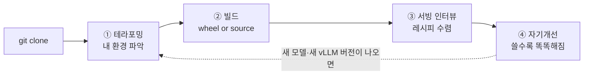
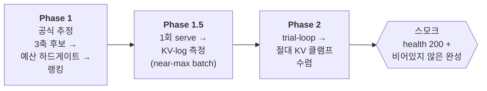

# easy-vllm

> **새 LLM이 나올 때마다 반복되는 "추론엔진 호환 대기 → 소스빌드 → 비패턴 땜질 패치" 의 고통을, 코드에이전트와의 대화 한 줄로 바꿉니다.**
>
> *Upstream-tracking vLLM container & serving-strategy generator — a portable skeleton + generation engine.*

---

## 이게 왜 필요한가요?

자체 호스팅으로 LLM을 띄워 본 분이라면 이 장면이 익숙할 겁니다.

```text
  새 모델이 나온다              vLLM 호환이 안정화되기까지 시차          그 사이 당신이 떠안는 것
  ───────────────              ─────────────────────────────          ──────────────────────
   🎉 DeepSeek-V4-Flash   ──▶   ⏳ 며칠 ~ 몇 주                   ──▶    😱 vLLM을 소스로 직접 빌드
   🎉 Qwen3.5-122B               · prebuilt wheel 아직 없음               😱 C++ ABI 벽 뚫기
   🎉 gpt-oss-120b               · 내 GPU 아키텍처 미지원                 😱 매번 다른 비패턴 땜질 패치
                                 · "auto" 가 OOM 내고 호스트째 다운        😱 OOM·NCCL·랑데부 디버깅
```

문제는 이 작업이 **매번 다르다**는 데 있습니다. 모델마다, vLLM 버전마다, GPU 아키텍처마다 막히는 지점과 푸는 방법이 달라서 — 한 번 성공한 노하우를 다음에 그대로 못 씁니다. 그래서 비전공자에게는 진입장벽이고, 전문가에게도 매번 반복되는 소모전입니다.

**easy-vllm 은 이 반복 노동을 코드에이전트에게 위임합니다.**

```text
  easy-vllm 을 켜면
  ─────────────────
   git clone  ─▶  코드에이전트에게 "이 프로젝트 어떻게 써?" 한마디
        └─▶  ① 내 환경 테라포밍  ─▶  ② 컨테이너 빌드(wheel 또는 source)
             ─▶  ③ 서빙전략 인터뷰  ─▶  ④ 자기개선 루프 (쓸수록 똑똑해짐)

   당신은 갈림길(HITL 게이트)에서 "확인" 만 누릅니다.
   torch 핀·NGC 베이스 태그·KV 클램프 같은 무거운 계산은 결정론 스크립트가 대신합니다.
```

> 💡 **핵심 아이디어 하나**: easy-vllm 은 *완성된 컨테이너*가 아니라 **"스켈레톤 + 생성엔진"** 입니다. 당신이 클론한 건 빈 골격과 엔진이고, *당신 환경에 맞는 실제 컨테이너는 당신 손에서 생성*됩니다. 그래서 노드 IP·NAS 경로 같은 개인정보가 레포에 박히지 않고, 누구의 환경으로도 이식됩니다.

---

## 개발자의 편지 — 범용성에 관하여

> 이 프로젝트를 만들면서 제가 지킨 원칙 하나를 먼저 고백하고 싶습니다.
>
> 저는 **하드코딩을 의도적으로 억제**했습니다. CPU 아키텍처는 빌드타임에 `$(uname -m)` 으로 읽고, GPU·노드·NAS 경로는 전부 `manifest` 라는 포인터에서 읽습니다. 그래서 이 프로젝트는 특정 머신에 묶여 있지 않습니다.
>
> 제 바람은 이렇습니다 — **일반 PC 한 대든, NVLink 없이 RTX Pro 6000 을 여러 대 꽂은 서버든, 코드에이전트가 그 하드웨어 환경을 *스스로 파악하고 적응* 하기를** 기대합니다. 그게 "코드에이전트를 생성엔진으로 둔다"는 설계의 핵심입니다.
>
> 다만 정직하게 밝힙니다. **지금까지의 실증은 전부 NVIDIA DGX Spark(GB10, aarch64) 1~2대에서 이뤄졌습니다.** 일반 x86 PC나 비-NVLink 멀티GPU 환경은 *설계상 지원하지만 아직 검증되지 않았습니다.* 이 README의 모든 `실제로 이렇게 검증됨` 박스는 DGX Spark 실측이며, 그 밖의 환경은 코드에이전트의 적응력에 기대고 있는 *가설*입니다.
>
> 그러니 이 글을 읽는 당신이 다른 하드웨어에서 이걸 돌려본다면 — 그 자체가 이 프로젝트의 다음 챕터입니다.

---

## 큰 그림 — 한 사이클

아래가 당신이 겪게 될 전체 흐름입니다. 이 README는 이 그림을 따라 **한 편의 이야기**로 진행됩니다.



핵심은 마지막 점선입니다. **한 바퀴 돌고 끝이 아니라, 새 모델·새 버전이 나올 때마다 다시 돌면서 시스템이 누적적으로 더 똑똑해집니다**(여정 ④).

> 📖 **이 문서를 읽는 법**: 아래부터는 *방금 `git clone` 을 마친 한 명의 개발자(=당신)* 와 *코드에이전트* 의 대화로 진행됩니다. 대화 속 에이전트의 판단·수치는 **실제 작업 이력(devlog/testlog)에서 가져온 것**입니다. 꾸며낸 시나리오가 아닙니다.

---

## 여정 0 — "이 프로젝트 어떻게 써요?"

클론을 마치고, 레포 안에서 코드에이전트(Claude Code)를 켭니다. 첫 질문은 누구나 똑같습니다.

> 👤 **당신**: 이 프로젝트 어떻게 쓰면 돼?
>
> 🤖 **에이전트**: 먼저 *당신 환경*부터 봅니다. 이 프로젝트는 제가 당신 하드웨어에 맞춰 vLLM 컨테이너를 직접 설계하는 구조라서요. 순서는 이렇습니다 —
> 1. **테라포밍**: 당신 노드·GPU·NAS 경로를 `manifest` 에 채웁니다. (단일노드면 5분, 멀티노드면 제가 스캔·인터뷰합니다)
> 2. **빌드**: 띄우려는 vLLM 버전을 알려주시면, prebuilt wheel 로 갈지 소스빌드로 갈지를 *제가 결정론적으로 판정* 하고 컨테이너를 빌드합니다.
> 3. **서빙 인터뷰**: 어떤 모델을 어떤 GPU 예산으로 띄울지 정하면, 제가 레시피를 인터뷰로 좁혀 실제로 띄워보고 검증합니다.
> 4. 그리고 쓰실수록 시스템이 **스스로 개선**됩니다.
>
> 어디부터 시작할까요? 당신 환경이 **노드 한 대**인가요, **여러 대**인가요?

이 한 번의 교환이 전체 여정의 지도입니다. 이제 하나씩 따라가 봅시다.

---

## 여정 1 — 테라포밍: 내 환경을 시스템에 알려주기

"테라포밍"이란 *빈 골격(스켈레톤)에 당신 환경의 실제 값을 채워 넣는 일*입니다. 그 값은 `manifest.yaml` 이라는 한 파일에 모입니다. 추적되는 건 빈칸짜리 `manifest.template.yaml` 뿐이고, 당신이 채운 실값(`output/<topology>/manifest.yaml`)은 git에 올라가지 않습니다 — **개인정보가 레포에 새지 않습니다.**

### 단일노드 — 5분이면 끝

> 👤 **당신**: 노드 한 대야. RTX 한 장.
>
> 🤖 **에이전트**: 그러면 간단합니다. `output/single/manifest.yaml` 에 GPU 모델·CUDA·NAS 경로만 채우면 됩니다. `nodes[]` 는 비워두세요 — 그러면 시스템이 **dormant(독립 운용)** 모드로, 외부 노드 없이 자기 완결적으로 동작합니다.

단일노드 테라포밍은 사실상 *manifest 채우기 한 번*입니다. `topology`·`cpu_arch`·`cuda_version`·`gpu_model`·`nas_model_path` 정도가 핵심 키입니다. 끝나면 바로 여정 2(빌드)로 갑니다.

### 멀티노드 — 에이전트가 스캔하고 인터뷰합니다 (1-1)

노드가 둘 이상이면 이야기가 달라집니다. 메인노드와 서브노드가 어떻게 연결돼 있고, 인터커넥트가 분산 서빙을 감당할 만큼 빠른지를 *실측* 해야 하니까요. 이때 **`terraforming_subnode`** 스킬이 발동합니다.

```text
   메인노드 (당신이 앉아 있는 곳)                     서브노드 (서브노드에도 코드에이전트 설치 필수)
   ┌───────────────────────────────┐                  ┌─────────────────────────┐
   │  코드에이전트 (오케스트레이터)  │                  │  코드에이전트 (원격 일꾼) │
   │  · 5-전제 인터뷰               │  ── SSH ──▶     │  · scan_node.py 실행    │
   │  · 성능 게이트 판정            │  ◀─ 리포트 ──    │  · 자기 환경 self-검증   │
   │  · manifest 생성              │                   │                        │
   │  · 서브 에이전트 환경 렌더·배달 │  ══ RoCE v2 ══▶  │  Ray worker (TP=2)     │
   └───────────────────────────────┘  고속 인터커넥트   └────────────────────────┘
```

에이전트는 절대 무단으로 남의 노드를 스캔하지 않습니다. 먼저 **5가지 전제조건**을 인터뷰합니다 — ①고속 인터커넥트 연결 ②네트워크 구성 ③SSH 구성 ④서브노드에 Claude Code 설치 ⑤서브 Claude Code 모델 연결. 당신이 *명시적으로 승인* 한 뒤에야 스캔이 시작됩니다.

> 👤 **당신**: 두 대야. ConnectX-7 으로 연결돼 있고, SSH 도 된다. 스캔해도 좋아.
>
> 🤖 **에이전트**: (`scan_node.py` 실행) 탐지했습니다 — `cpu_arch=aarch64`, `cuda_version=132`, `gpus_per_node=1`, 인터커넥트 `RoCE v2`(`gid_index=3`). compose의 NCCL 설정과도 교차검증해 `all_match=TRUE`. 이제 성능 게이트를 확인합니다. `ib_write_bw` 로 실측하겠습니다.
>
> 🤖 **에이전트**: 포트별로 104.2 + 104.0 = **합산 208.2 Gb/s**. 합격선(포트당 ≥100, 합산 ≥180)을 넘었습니다 → **multi-ready**. manifest 에 기입할까요?

여기서 중요한 설계가 하나 있습니다. **성능이 합격선에 못 미치면 에이전트는 fail-closed 로 멈춥니다** — manifest 를 만들지 않고, 비정상 종료합니다. "느린데 일단 진행"을 코드가 막습니다. 검증 안 된 분산 구성으로 나아가다 한밤중에 OOM 으로 깨는 일을 방지하는 거죠.

manifest 가 확정되면, 에이전트는 **서브노드의 작업환경 자체를 렌더해서 배달**합니다 — 서브 전용 페르소나(`CLAUDE.md`)·능력카드(`Agent_Card.json`)·스코프드 권한·런타임 스킬·통신 프로토콜. 이 템플릿들은 전부 **PII-free**(IP·호스트명이 안 박힘)이고, 배달 시점에 manifest 값으로 치환됩니다. 마지막으로 **모델 없는 카나리 태스크**를 한 번 보내 서브가 새 환경을 제대로 로드했는지 확인합니다.

> ✅ **실제로 이렇게 검증됨** (DGX Spark ×2 / `testlog_2026062314_1`)
> - 스캔 → 성능게이트 → manifest 생성의 **5개 게이트 분기를 전부 라이브 검증**: α(단일) / γ-blocked(peer 미도달) / γ-blocked(대역폭 100<180, fail-closed) / multi-ready / 3자-일치 단언. **판정: PASS.**
> - `ib_write_bw` 실측 **합산 208.2 Gb/s**(104.2+104.0), 200Gbps 풀대역폭의 ~90%.
> - 메인↔서브 양방향 싱크(D12): dirty 트리면 **배달 거부(fail-closed)**, 서브 git 은 origin 영구 미설정(로컬 전용). 6개 종료조건 라이브 PASS.

> 🤖 그래서 다음은 자연히 — *이 환경 위에 어떤 vLLM 컨테이너를 올릴까* 입니다.

---

## 여정 2 — 빌드: wheel 의 쉬운 길, source 의 어려운 길

이제 vLLM 버전을 정합니다. easy-vllm 의 가장 똑똑한 부분이 여기서 드러납니다 — **에이전트가 "쉬운 길로 갈 수 있는지, 어려운 길로 가야 하는지"를 추측이 아니라 결정론으로 판정** 합니다.

판정의 근거는 **레이어 커플링**입니다. vLLM 버전이 요구하는 torch 버전이 정해져 있고, torch 버전이 베이스 이미지(NGC PyTorch)와 빌드 방식을 결정합니다.

```text
   레이어 커플링 — 위에서 아래로 결정론으로 흐른다
   ──────────────────────────────────────────
   vLLM 버전          (당신이 지정)          예) 0.18.0          예) 0.23.0
       │  pyproject.toml [build-system].requires
       ▼
   torch 핀                                 2.10.0             2.11.0
       │  접두어 매칭
       ▼
   NGC PyTorch 베이스 태그                    26.01-py3          26.03-py3 …(→ 26.05 로 오버라이드)
       │  torch 세대로 분기
       ▼
   빌드 트랙          ──────────────▶         🟢 prebuilt wheel   🔴 소스빌드 (ABI 벽)
                                                  "쉬운 길"            "어려운 길"
```

### 쉬운 길 — prebuilt wheel (torch 2.10대)

> 👤 **당신**: vLLM 0.18.0 으로 gpt-oss-20b 띄우고 싶어.
>
> 🤖 **에이전트**: 0.18.0 은 torch **2.10.0** 을 요구합니다 → ABI 벽 없음 → **prebuilt wheel 트랙**. NGC 베이스는 접두어 매칭으로 `26.01-py3`. wheel(`vllm-0.18.0+cu130-...aarch64.whl`)을 `pip install --no-deps` 로 설치하고(그 전에 `/etc/pip/constraint.txt` 를 비워 NGC 핀 충돌을 피합니다), 빌드하면 끝입니다.

이게 "정규 path" 입니다. 막힘이 적습니다. 그래도 폐쇄망 특유의 자잘한 함정은 있습니다 — tiktoken 인코딩 파일 경로가 틀려 404 가 나거나, 의존성이 시간이 흐르며 깨지는(예: fastapi 0.138 이 `/health` 를 500 으로 만든) 경우. 에이전트는 이것들도 참조-그라운디드로 잡아냅니다.

> ✅ **실제로 이렇게 검증됨** (`devlog_2026062221_1`)
> - 이미지 `easy-vllm:0.18.0-cu130-aarch64-wheel` (32.8GB), 의존성 59개 재생성.
> - tiktoken 404 → 경로 교정(sha256 검증) · fastapi 0.138 회귀 → `<0.137.0` 천장 핀.
> - **2 trial 만에 수렴** → 스모크 PASS.

### 어려운 길 — 소스빌드 (torch 2.11+)

> 👤 **당신**: 이번엔 vLLM 0.23.0 으로 가자.
>
> 🤖 **에이전트**: 0.23.0 은 torch **2.11.0** 을 요구합니다. 여기서 문제가 생깁니다 — NGC 의 torch 는 alpha 빌드라 prebuilt `_C`(vLLM 의 C++ 확장)와 **C++ ABI 가 충돌** 합니다. 이게 **"하드 ABI 벽"** 입니다. prebuilt wheel 을 깔면 *빌드는 되지만 서빙 시점에 조용히* 깨집니다. 그래서 **소스빌드 트랙**으로 갑니다.

이 "ABI 벽"이 바로 비전공자가 혼자 만나면 가장 고통스러운 지점입니다. 버전 문자열만 봐서는 아무 경고도 없거든요. 실제로 어떻게 풀렸는지 보시죠.

<details>
<summary>📂 <b>ABI 벽을 뚫은 실제 과정</b> (펼쳐 보기 — 이게 이 프로젝트가 당신 대신 해주는 일입니다)</summary>

> 🤖 **에이전트**: 접두어 매칭으로 NGC `26.03` 을 골라 빌드했습니다. 485초 컴파일 후 실패했습니다:
> ```
> error: class "torch::stable::Tensor" has no member "layout"
> error: no instance of overloaded function "torch::stable::from_blob" matches
> ```
> 26.03 의 torch 에 이 stable-ABI 심볼이 *없습니다*. 추측으로 베이스를 바꾸지 않겠습니다 — **후보 베이스의 헤더를 직접 grep 해서 심볼이 존재함을 먼저 증명** 합니다.
>
> | API | 26.03 (torch 2.11.0a0) | 26.05 (torch 2.12.0a0) |
> |---|---|---|
> | `Tensor::layout()` | **부재** | **있음** (`tensor_struct.h:440`) |
> | `from_blob` 오버로드 | 불일치 | **있음** (`ops.h:690/741/787`) |
>
> 26.05 에 심볼이 있음을 확인했습니다. 이 증거를 testlog 에 남기고, **당신 승인 후** `resolved.json` 의 NGC 태그만 26.05 로 오버라이드하겠습니다. (헌법: 무증거 오버라이드 금지)

이게 **"증거기반 오버라이드"** 입니다. 결정론 스크립트가 단발 추천(26.03)을 하고, 그게 실패하면 에이전트가 *권위 있는 참조(헤더 파일)를 직접 읽어* 다음 수를 증명한 뒤, 사람의 승인을 받아 한 줄만 고칩니다.

</details>

> ✅ **실제로 이렇게 검증됨** (`testlog_2026062217_1`)
> - 0.23.0 → torch 2.11.0 → 소스빌드, NGC `26.03` 빌드 실패 → 증거기반 `26.05` 오버라이드 → 성공.
> - 빌드 버전 `vllm-0.23.1.dev0+g0fc695fc6.d20260622.cu132`, `TORCH_CUDA_ARCH=12.1a`, 이미지 `easy-vllm:0.23.0-cu132-aarch64-source`(49.9GB). 런타임 `import vllm._C` OK — **ABI 벽 해소**.

### 어려운 길의 끝 — 포크 SHA 핀 (이렇게까지도 해냅니다)

가장 극단적인 경우도 있습니다. **모델 아키텍처를 stock vLLM 이 구조적으로 못 띄우는** 상황(arch-wall)입니다. 이때 패치 범위는 사다리처럼 확장됩니다: *deps 패치 → 소스-게이트 패치 → vLLM 소스-repo 오버라이드(포크 SHA 핀) → 체크포인트 교체.*

<details>
<summary>🔬 <b>DeepSeek-V4-Flash on GB10 sm_121 — 6번의 실패 끝에</b></summary>

DeepSeek-V4-Flash 를 GB10(sm_121)에 띄우려 하자 stock vLLM 이 이중 하드월에 막혔습니다 — (1) sparse-MLA 어텐션이 `major∈[9,10]` 만 허용 (2) MXFP4 MoE 가 `auto → MARLIN-repack → 통합메모리 OOM → 호스트째 하드다운`. **6번 연속 실패** 하고 호스트가 다운됐습니다.

해법은 커뮤니티 포크였습니다 — `jasl/vllm` PR#41834(SM12x 지원). 에이전트는 *태그명이 아니라 SHA(`c766cbc6...`)로 핀*(force-push 면역)하고, `VLLM_REPO`/`VLLM_REF` 빌드-arg 로 같은 Dockerfile 이 stock/포크로 분기하게 했습니다. 새 트랙 `easy-vllm:0.23.0-cu132-aarch64-source-sm12x`(기존 모델은 유지하는 superset 변종).

그래도 두 고비가 더 있었습니다 — `--moe-backend humming`(auto 는 포크에서도 repack-OOM) 명시, 그리고 GB10 의 통합메모리가 클럭 텔레메트리를 노출 안 해서 생긴 NVML 크래시를 잡는 **빌드-바깥 패치**(`40-humming-nvml-gb10.sh`). 마침내 **serve#8 에서 서빙 성공** — KV 386,512 토큰(11.8×), 추론 응답 정상, 호스트 다운 0.

</details>

> 🤖 컨테이너가 떴습니다. 이제 *이 모델을 당신 GPU 예산에 가장 잘 맞게 어떻게 띄울지* 를 정할 차례입니다.

---

## 여정 3 — 서빙전략 인터뷰: 띄울 수 있다 ≠ 잘 띄운다

컨테이너가 빌드됐다고 끝이 아닙니다. 같은 모델도 *KV 캐시를 얼마나 줄지, 컨텍스트 길이를 얼마로 할지, 배치를 얼마나 받을지* 에 따라 OOM 이 나기도, VRAM 을 절반만 쓰기도 합니다. 이걸 **`vllm-recipe-explorer`** 스킬이 인터뷰로 좁힙니다.

핵심 철학은 **"측정 > 공식"** 입니다. per-token KV 공식은 full-attention 을 가정해서, sliding-window·GQA 모델에선 KV 를 *크게 과대추정* 합니다. 그래서 공식으로 배치를 정하지 않고 — *실제로 한 번 띄워서 로그를 읽어* 정합니다.



3축은 `quantization × max-model-len × gpu-memory-utilization` 이고, 인터뷰는 당신에게 멀티턴으로 묻습니다 — **타겟 GPU/VRAM 예산**(0순위·필수), weight/KV 양자화, 배치·컨텍스트, tool/reasoning 파서, 어텐션 백엔드. 모르면 에이전트가 결정론 값을 제안합니다.

### 본류 — gemma-4-12b 가 깔끔하게 수렴한 과정

> 👤 **당신**: gemma-4-12b-it 를, GB10 예산(121.69 GiB)에, 컨텍스트 65536, 배치는 *유휴 VRAM 을 KV 로 최대* 로.
>
> 🤖 **에이전트**: (Phase 1.5 — 한 번 띄워 측정) 실측했습니다 — weights 22.83 GiB, overhead 3.77, **KV 가용 82.92 GiB**, `kv_cache_tokens` 2,613,867. 백엔드는 gemma 의 이종 head_dim 때문에 `TRITON_ATTN`. 로그의 `max_concurrency` 가 **39.88×** 네요.
>
> 🤖 **에이전트**: 공식대로면 배치 3 이 나왔겠지만, 측정값은 **배치 39** 입니다(공식이 ~11.5× 과대추정했습니다). Phase 2 로 절대 KV 클램프를 수렴시키겠습니다 → `kv-cache-memory-bytes 87064835597`(≈81 GiB), `gpu-memory-utilization 0.90`.

여기서 **gmu 0.90** 이 왜 0.92(기본값)가 아닌지가 중요합니다. GB10 의 통합메모리는 OS가 ~11GiB 를 점유해서, 기본 0.92 면 *시작도 못 하고 OOM* 으로 죽습니다. 그래서 에이전트는 **절대 KV 클램프(이식성)** 와 **gmu(시작 게이트) 를 함께** emit 합니다.

> ✅ **실제로 이렇게 검증됨** (`testlog_2026062217_2` / simlog `2026062217_1`)
> - 2 trial 수렴. 최종: `max-model-len 65536` · `max-num-seqs 39`(측정) · `kv-cache-memory-bytes 87064835597` · `gmu 0.90`.
> - 스모크: `"Hello there!"`, `finish_reason=stop`. **판정: 합격.**

### 더 어려운 사례들 — 그리고 가장 중요한 교훈

<details>
<summary>🔬 <b>DeepSeek-V4-Flash 최적화 — 실패가 다음 성공을 증명하다</b></summary>

DeepSeek-V4-Flash 를 더 최적화하는 과정에서, `gmu 0.90` 으로 올리자 KV 가 31.42 GiB 로 풍선처럼 부풀어 **메모리 워치독이 SIGKILL(137)** 로 컨테이너를 죽였습니다(호스트는 워치독이 보호). 이 실패가 오히려 *절대 KV 클램프가 옳다는 증거* 가 됐습니다 — `gmu 0.80` + `enforce-eager` + `kv-cache-memory-bytes 17179869184`(16GiB)로 재유도하니 **serve#10 PASS**(추론과 답 '391' 분리). 함수호출까지 붙여 serve#11 PASS(`get_weather(Seoul)` tool_calls + reasoning 협업).

곁들인 함정 하나: 실행 중인 컨테이너에 yaml 만 고치고 `compose up -d` 하면 **변경이 무시**됩니다. recipe 만 바꿨을 땐 반드시 `down → up` 으로 재생성해야 합니다.

</details>

<details>
<summary>🔬 <b>Qwen3.5-122B-NVFP4 — "carry-forward 금지" 가 살린 사례</b></summary>

이전에 Qwen3-Next-80B(bf16)를 띄울 때 `--moe-backend triton` 이 정답이었습니다. 그래서 122B-NVFP4 에도 그대로 가져왔더니 — **실패**: `moe_backend='triton' is not supported for NvFP4 MoE`. 플래그를 빼서 `auto` 에 맡기니 vLLM 이 `FLASHINFER_CUTLASS` 를 골라 **PASS**.

교훈: **모델별 서빙전략은 carry-forward 금지.** 한 모델의 정답(triton)이 다른 모델(NVFP4)엔 독입니다. 정답은 *모델×하드웨어마다* reference-grounded 로 재확정해야 합니다.

</details>

> ✅ **실제로 이렇게 검증됨** — 멀티노드 진성 분산 서빙(Ray TP=2, 한 모델을 두 노드가 함께 서빙) **3 조합 3/3 PASS**: ① 0.18.0/wheel × gpt-oss-120b(near-max 176) ② 0.23.0/source × gpt-oss-120b(near-max 150, 양노드 core byte-identical → layer-cache 재사용) ③ 0.23.0/source × Qwen3-Next-80B(`--moe-backend triton` 으로 sm_121a JIT-OOM 우회).

> 🤖 이제 한 사이클이 끝났습니다. 그런데 — 당신이 이 시스템을 *쓸수록*, 시스템 자체가 더 나아집니다. 그게 마지막 여정입니다.

---

## 여정 4 — 자기개선 루프: 쓸수록 똑똑해지는 이유

대부분의 도구는 처음 상태 그대로입니다. easy-vllm 은 다릅니다. **당신이 코드에이전트와 코웍한 한 번 한 번이, 다음 작업을 더 쉽게 만드는 자산으로 쌓입니다.** 세 가지 메커니즘이 맞물려 돕니다.

```text
   자기개선 루프 — 실행에서 배운 것이 위로 흐른다
   ──────────────────────────────────────────

        ┌─────────────────────────────────────────────────┐
        │   기초레이어 = 헌법(철학) = 단일 진실원천          │  ◀── 새 교훈이 "따름정리" 로 codify
        └─────────────────────────────────────────────────┘
                  │  변경되면 (위→아래로만)
                  ▼  conformance 스윕 = 정합 회복까지가 "1건"
        ┌───────────────────────────────────────────────────┐
        │   상위레이어 = 스킬 · workflow · recipe · 산출물    │
        └───────────────────────────────────────────────────┘
                  ▲
                  │  실제로 띄워본 작업이 devlog/testlog 로 남고
        ┌──────────────────────────────────────────────────┐
        │   사서(wiki-desk) = 작업이력 관계그래프            │  ── 다음 인터뷰 때 관련 맥락을 빠르게 떠올림
        └──────────────────────────────────────────────────┘
```

**① 레이어드 적응** — 헌법(철학)이 기초레이어이고 단일 진실원천입니다. 새 교훈을 얻으면 그것을 헌법에 **따름정리(corollary)** 로 적습니다. 그러면 상위레이어(스킬·workflow·recipe)가 그 변경에 *적응 패치* 해 정합을 회복합니다 — 그것도 **부분수정 방치 없이, 정합이 완전히 돌아올 때까지가 작업 1건**입니다. (역방향은 금지: 상위의 편의가 헌법을 흔들지 못합니다.)

> 흥미로운 실화: 이 "정합 회복까지 1건" 원칙이 *코드화된 바로 그 순간*, 적대검증이 에이전트 자신의 부분수정(생산자만 고치고 소비자를 빠뜨림)을 잡아냈습니다. **원칙이 만들어지자마자 자기 저자를 단속한** 셈입니다.

**② 사서(wiki-desk)** — 모든 작업이력(plan/devlog/testlog/simlog)을 **결정론 관계그래프**(누가 무엇을 실현/증거/인용하는지)로 엮습니다. 새 작업을 시작할 때, 사서가 *"이 모델·이 버전에서 전에 뭐가 됐고 뭐가 실패했는지"* 를 권위 순으로 떠올려 줍니다 — 단순 검색기가 아니라 인터뷰 의도를 해석해 수렴을 가속합니다. 권위는 **실행진실 > 계획의도**(`devlog 100 > testlog 85 > plan 55 …`). 그리고 의도적으로 **헌법은 인덱싱하지 않습니다** — 도서관이 헌법에 정렬되면 도전이 불가능해지니까요(반-확증편향). 도서관은 중립 증거기반, 헌법은 그 증거를 본 사람의 *출력*입니다.

> 📌 이 README 를 쓰면서도 사서를 불렀습니다. 설치·검증 시점엔 **61개 문서 / 137개 관계** 였는데, 지금은 **75개 / 190개** 로 자라 있습니다. *쓸수록 쌓인다* 는 말이 그대로 데이터로 보입니다.

**③ 메인↔서브 개선 role** — 멀티노드에서 서브노드가 얻은 통찰은 *문서로만* 회수됩니다(코드/설정 추출 없음). 메인이 그 문서를 읽고(HITL), 템플릿→렌더→배달 파이프라인으로 서브 환경을 다시 개선합니다. 이게 "self-improving tooling" 입니다 — 서브의 개인정보는 메인 추적물로 새지 않으면서도, 배운 것은 시스템에 환원됩니다.

이 루프 덕분에, *모델구동 런타임 패치*(stock 이미지에 휘발성 몽키패치를 arming)나 *per-model 3+1+1 아티팩트 패턴* 같은 노하우가 — 일회성 땜질로 끝나지 않고 — **재현 가능한 방법론**으로 굳습니다. 처음에 말한 "매번 다른 비패턴 땜질"의 정반대입니다.

---

## 닫는 글

여기까지가 한 사이클입니다 — **clone → 테라포밍 → 빌드 → 서빙 인터뷰 → 자기개선**. 그리고 새 모델이나 새 vLLM 버전이 나오면, 당신은 다시 "vLLM X로 업데이트" 한마디로 이 사이클을 돕니다. 매번 조금씩 더 쉬워지면서요.

이 모든 흐름을 떠받치는 안전 가드 셋만 기억하시면 됩니다:

- 🔒 **스모크 통과 전 done 없음** — 실제로 띄워 비어있지 않은 응답을 받아야 "됐다"입니다. ("lint 통과 ≠ 서빙됨")
- 🔒 **무인 자동 다운로드 없음** — 폐쇄망 전제. 모델은 사람이 NAS 에 미리 두고 read-only 마운트, 부재 시 *사용자 승인 게이트* 후에만.
- 🔒 **결정론은 스크립트가, 판단은 에이전트가** — torch 핀·NGC 태그 같은 버전 해소는 확률적 추론이 아니라 결정론 스크립트가 처리하고, 사람은 HITL 게이트에서 확인합니다.

### 더 깊이 들어가려면

이 README 는 *여정* 을 보여줍니다. 각 단계의 *규칙과 절차의 정본* 은 아래에 있습니다.

| 문서 | 무엇 |
| --- | --- |
| [`CLAUDE.md`](./CLAUDE.md) | 헌법 — 항상 보유하는 사실·불변식·모든 따름정리의 단일 진실원천 |
| [`.claude/rules/workflow.md`](./.claude/rules/workflow.md) | 전파 워크플로 — 버전 업데이트 S1~S4 4단계 + HITL 게이트 + 메인↔서브 싱크 |
| [`.claude/rules/docs.md`](./.claude/rules/docs.md) | 문서 4종(plan/devlog/testlog/simlog) 작성 규약 |
| `.claude/skills/` | 생성엔진 — `terraforming_subnode` · `upstream-version-watch` · `vllm-recipe-explorer` · `wiki-desk` |

> *검증 환경: 2× NVIDIA DGX Spark(GB10 superchip, aarch64, sm_121a, 128GB 통합메모리/노드, CUDA 13.2), 폐쇄망 NAS read-only, RoCE v2 / NCCL GPU Direct RDMA. 그 밖의 하드웨어는 코드에이전트의 적응에 기대는 미실증 영역입니다 — 「개발자의 편지」 참고.*
