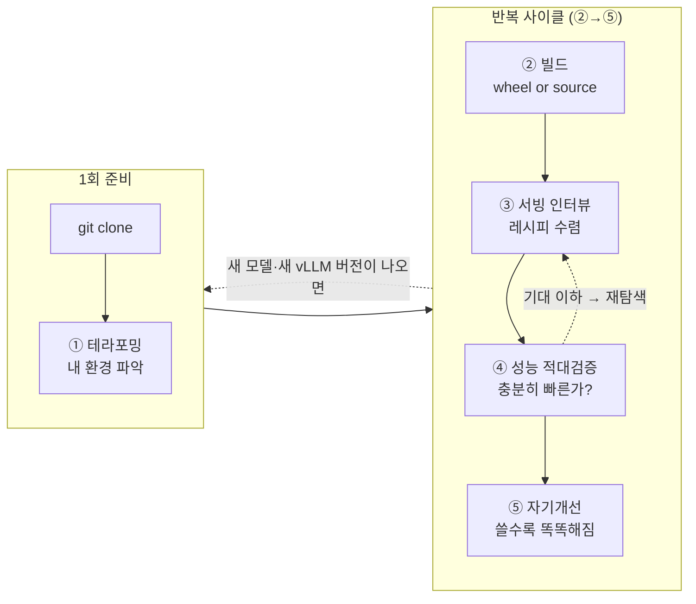
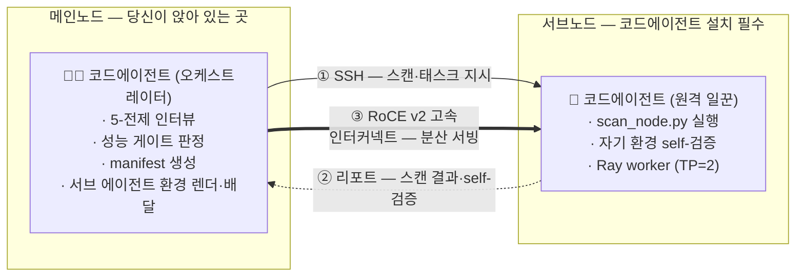
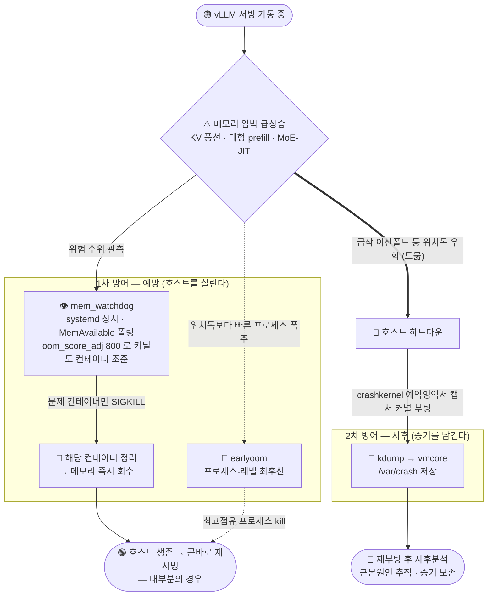
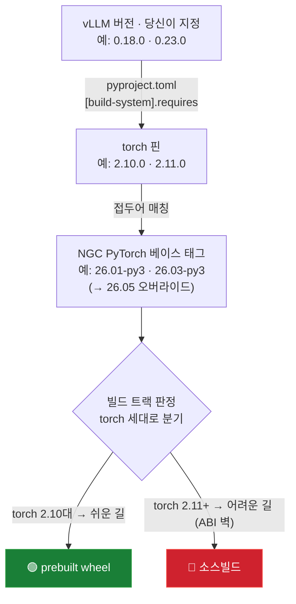
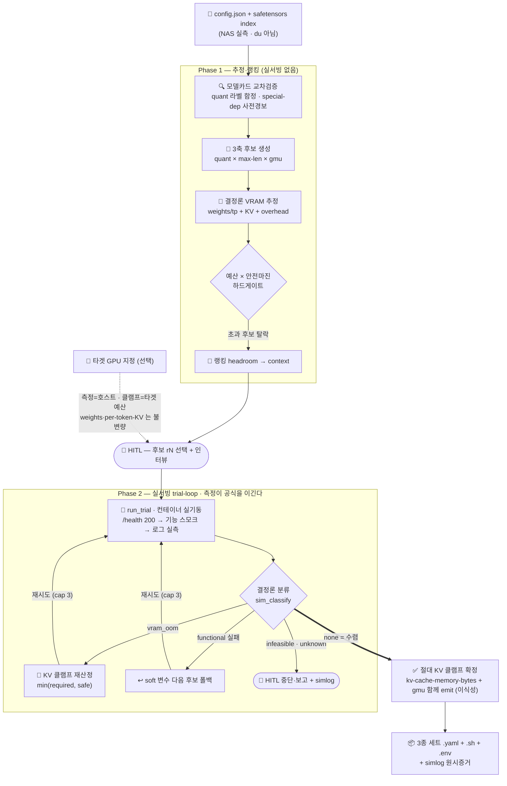
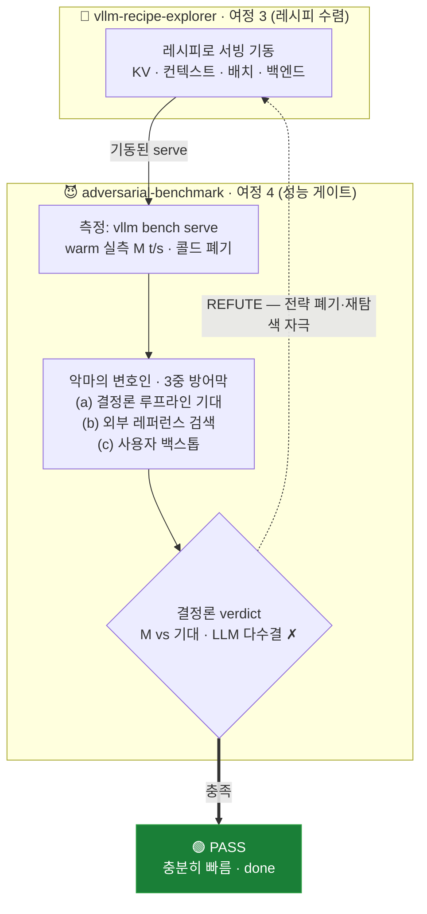
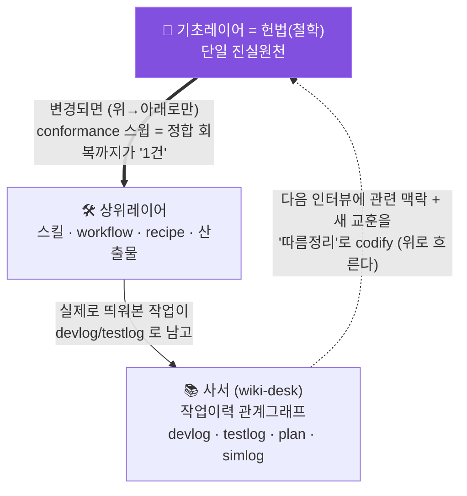

# easy-vllm

> **새 LLM이 나올 때마다 반복되는 "추론엔진 호환 대기 → 소스빌드 → 비패턴 땜질 패치" 의 고통을, 코드에이전트와의 대화 한 줄로 바꿉니다.**
>
> *Upstream-tracking vLLM container & serving-strategy generator — a portable skeleton + generation engine + 타겟-GPU 서빙 시뮬레이터.*

---

## 이게 왜 필요한가요?

자체 호스팅으로 LLM을 띄워 본 분이라면 이 장면이 익숙할 겁니다.

```text
  새 모델이 나온다              vLLM 호환이 안정화되기까지 시차          그 사이 당신이 떠안는 것
  ───────────────              ─────────────────────────────          ──────────────────────
   🎉 DeepSeek-V4-Flash   ──▶   ⏳ 며칠 ~ 몇 주                   ──▶    😱 vLLM을 소스로 직접 빌드
   🎉 Qwen3.5-122B               · prebuilt wheel 아직 없음               😱 C++ ABI 벽 뚫기
   🎉 gpt-oss-120b               · 내 GPU 아키텍처 미지원                 😱 매번 다른 비패턴 땜질 패치
                                 · "auto" 가 OOM 내고 호스트째 다운        😱 OOM·NCCL·랑데부 디버깅
```

문제는 이 작업이 **매번 다르다**는 데 있습니다. 모델마다, vLLM 버전마다, GPU 아키텍처마다 막히는 지점과 푸는 방법이 달라서 — 한 번 성공한 노하우를 다음에 그대로 못 씁니다. 그래서 비전공자에게는 진입장벽이고, 전문가에게도 매번 반복되는 소모전입니다.

**easy-vllm 은 이 반복 노동을 코드에이전트에게 위임합니다.**

```text
  easy-vllm 을 켜면
  ─────────────────
   git clone  ─▶  코드에이전트에게 "이 프로젝트 어떻게 써?" 한마디
        └─▶  ① 내 환경 테라포밍  ─▶  ② 컨테이너 빌드(wheel 또는 source)
             ─▶  ③ 서빙전략 인터뷰  ─▶  ④ 성능 적대검증(기대 이하면 재탐색)
             ─▶  ⑤ 자기개선 루프 (쓸수록 똑똑해짐)

   당신은 갈림길(HITL 게이트)에서 "확인" 만 누릅니다.
   torch 핀·NGC 베이스 태그·KV 클램프 같은 무거운 계산은 결정론 스크립트가 대신합니다.
```

> 💡 **핵심 아이디어 하나**: easy-vllm 은 *완성된 컨테이너*가 아니라 **"스켈레톤 + 생성엔진"** 입니다. 당신이 클론한 건 빈 골격과 엔진이고, *당신 환경에 맞는 실제 컨테이너는 당신 손에서 생성*됩니다. 그래서 노드 IP·NAS 경로 같은 개인정보가 레포에 박히지 않고, 누구의 환경으로도 이식됩니다.

---

## 개발자의 편지 — 범용성에 관하여

> 이 프로젝트를 만들면서 제가 지킨 원칙 하나를 먼저 고백하고 싶습니다.
>
> 저는 **하드코딩을 의도적으로 억제**했습니다. CPU 아키텍처는 빌드타임에 `$(uname -m)` 으로 읽고, GPU·노드·NAS 경로는 전부 `manifest` 라는 포인터에서 읽습니다. 그래서 이 프로젝트는 특정 머신에 묶여 있지 않습니다.
>
> 제 바람은 이렇습니다 — **일반 PC 한 대든, NVLink 없이 RTX Pro 6000 을 여러 대 꽂은 서버든, 코드에이전트가 그 하드웨어 환경을 *스스로 파악하고 적응* 하기를** 기대합니다. 그게 "코드에이전트를 생성엔진으로 둔다"는 설계의 핵심입니다.
>
> 이 프로젝트가 작성된 **README는 Nvidia DGX Spark(GB10) 1~2대 환경에서 실측된 정보를 바탕으로 하며,** 해당 프로젝트를 배포받은 다른 HW(x86_64 · RTX 5090 sm_120 · WSL2 단일노드)에서 테라포밍 → 소스빌드 → 서빙까지 한 사이클을 끝까지 통과했습니다. *단, 거기까지도 기능(잘 띄운다)이지 성능 게이트(여정 4)는 미실행* 임을 정직하게 병기합니다. 비-NVLink 멀티GPU 등 다른 축은 여전히 *설계상 지원하나 미검증* 입니다.
>
> 그리고 이제는 한 걸음 더 나아간 증거가 생겼습니다 — **또 다른 물리 머신(Ubuntu 22.04 · x86_64 · RTX PRO 6000 discrete 96GB · sm_120)에서, 이 스켈레톤이 vLLM 0.25.0/0.25.1 로 모델 11종을 서빙하고 그중 다수를 여정 4의 *성능 적대검증까지* 돌렸습니다.** GB10 은 통합메모리 슈퍼칩이지만 이쪽은 전혀 다른 축이에요 — 디스크리트 GPU 에 host RAM 60GiB 제약이 걸린 x86 리눅스입니다(위에서 바라던 "RTX Pro 6000 서버"의 *단일 카드* 판이죠 — 여러 대 NVLink-less 구성은 아직 다음 숙제입니다). 그런데도 같은 생성엔진이 mistral-small-4-119b · nemotron-3-super · qwen3.5-122B-NVFP4 · gpt-oss-120b · exaone-4.5 · gemma-4 계열을 *각자의 벽*(Mistral 네이티브 포맷 · MoE 커널 JIT 로 인한 host RAM 폭증 · Mamba 캐시블록 한계 · MARLIN mxfp4 커널 천장…)을 뚫고 띄웠고, **7종은 성능 게이트 PASS(예: qwen3.6-27b 92% MBU), 4종은 host-RAM·커널 천장에 걸려 *정직하게 REFUTE***로 남았습니다 — "느린데 통과"라고 우기지 않는 게 이 프로젝트의 고집이니까요. 그 결과는 전부 `hint/…/rtxpro6000` 태그로 공유 저장소에 되돌아왔습니다(전체 이력 → [`HINTS.md`](./HINTS.md)). *제가 바라던 "코드에이전트가 낯선 하드웨어를 스스로 파악하고 적응한다"의, 성능 게이트까지 완주한 첫 실증입니다.*
>
> 그러니 이 글을 읽는 당신이 다른 하드웨어에서 이걸 돌려본다면 — 그 자체가 이 프로젝트의 다음 챕터입니다.

---

## 큰 그림 — 한 사이클

아래가 당신이 겪게 될 전체 흐름입니다. 이 README는 이 그림을 따라 **한 편의 이야기**로 진행됩니다.



위 워크플로우에서 핵심은 **반복 사이클 (②→⑤)**과 **새 모델·새 vLLM 버전이 나오면** 부분으로 새 모델·새 버전이 나올 때마다 다시 돌면서 시스템이 누적적으로 더 똑똑해집니다**(여정 ⑤).

> 📖 **이 문서를 읽는 법**: 아래부터는 *방금 `git clone` 을 마친 한 명의 개발자(=당신)* 와 *코드에이전트* 의 대화로 진행됩니다. 대화 속 에이전트의 판단·수치는 **실제 작업 이력(devlog/testlog)에서 가져온 것**입니다. 꾸며낸 시나리오가 아닙니다.

---

## 여정 0 — "이 프로젝트 어떻게 써요?"

클론을 마치고, 레포 안에서 코드에이전트(Claude Code)를 켭니다. 첫 질문은 누구나 똑같습니다.

> 👤 **당신**: 이 프로젝트 어떻게 쓰면 돼?
>
> 🤖 **에이전트**: 먼저 *당신 환경*부터 봅니다. 이 프로젝트는 제가 당신 하드웨어에 맞춰 vLLM 컨테이너를 직접 설계하는 구조라서요. (그래서 테라포밍이 끝나기 전엔 제가 *일반 정보·조언* 만 드립니다 — 당신 GPU·OS·모델 위치를 모르는 채로 "TP 8로 띄우세요" 같은 *근거 없는* 답을 지어내지 않습니다. 그건 실제 배포에서 사고로 이어졌고, 그래서 막아뒀습니다.) 순서는 이렇습니다 —
> 1. **테라포밍**: 당신 노드·GPU 와 **모델을 어떻게 확보할지**(이미 NAS에 받아둔 걸 쓸지·컨테이너에 그때그때 받을지·특정 경로에 둘지)를 `manifest` 에 채웁니다. (단일노드면 5분, 멀티노드면 제가 스캔·인터뷰합니다)
> 2. **빌드**: 띄우려는 vLLM 버전을 알려주시면, prebuilt wheel 로 갈지 소스빌드로 갈지를 *제가 결정론적으로 판정* 하고 컨테이너를 빌드합니다.
> 3. **서빙 인터뷰**: 어떤 모델을 어떤 GPU 예산으로 띄울지 정하면, 제가 레시피를 인터뷰로 좁혀 실제로 띄워보고 검증합니다.
> 4. **성능 적대검증**: 띄운 게 *충분히 빠른지* 까지 제가 적대적으로 검증하고, 기대 이하면 전략을 다시 짭니다.
> 5. 그리고 쓰실수록 시스템이 **스스로 개선**됩니다.
>
> 어디부터 시작할까요? 당신 환경이 **노드 한 대**인가요, **여러 대**인가요?

이 한 번의 교환이 전체 여정의 지도입니다. 이제 하나씩 따라가 봅시다.

> 💡 **팁 — 에이전트가 "멈춘 것처럼" 보일 때**: 큰 작업은 겉보기에 조용합니다. 예컨대 대형 모델을 2노드에
> 로드하는 데만 20~30분이 걸리기도 하고(체크포인트가 느린 NAS에 있으면 더), 소스빌드는 그보다 오래 걸립니다.
> 이때 터미널이 한참 조용하면 *에이전트가 뻗은 것*처럼 오해하기 쉽지만, 대개는 묵묵히 일하는 중입니다. 그럴 땐
> 채팅창에 이렇게 한마디만 던지세요 —
>
> > 👤 **당신**: 작업이 진행중이면 한 3~5분 단위로 곁눈질해서 현재 프로세스가 어디까지 진행되고 있는지 알림 보내줄래?
>
> 그러면 에이전트가 백그라운드 감시를 걸어 *지금 몇 % 로드했는지 · 노드별 메모리 여유는 얼마인지 · 다음 관문은
> 무엇인지* 를 주기적으로 짧게 보고합니다. "살아있고, 여기까지 왔다"가 눈에 보이니 안심하고 기다릴 수 있고,
> 정말로 문제가 생겼을 때(예: 메모리가 안전선 밑으로 떨어짐)도 곧바로 알아챌 수 있습니다. — *이 프로젝트를
> 실제로 굴리며 얻은, 가장 자주 쓰게 되는 한 줄입니다.*

---

## 여정 1 — 테라포밍: 내 환경을 시스템에 알려주기

"테라포밍"이란 *빈 골격(스켈레톤)에 당신 환경의 실제 값을 채워 넣는 일*입니다. 그 값은 `manifest.yaml` 이라는 한 파일에 모입니다. 추적되는 건 빈칸짜리 `manifest.template.yaml` 뿐이고, 당신이 채운 실값(`output/<topology>/manifest.yaml`)은 git에 올라가지 않습니다 — **개인정보가 레포에 새지 않습니다.**

### 단일노드 — 5분이면 끝

> 👤 **당신**: 노드 한 대야. RTX 한 장.
>
> 🤖 **에이전트**: 그러면 간단합니다. `output/single/manifest.yaml` 에 GPU 모델·CUDA, 그리고 **모델을 어디서 가져올지**를 정합니다 — 셋 중 하나예요: **managed**(이미 NAS에 받아둔 모델을 read-only 마운트) · **ephemeral**(컨테이너에 HuggingFace에서 그때그때 받기 — 컨테이너를 내리면 사라집니다; *일반 PC라면 보통 이 경우*) · **custom**(원하는 경로에 받아 마운트). `nodes[]` 는 비워두세요 — 그러면 **dormant(독립 운용)** 모드로 외부 노드 없이 자기 완결적으로 동작합니다.

단일노드 테라포밍은 사실상 *manifest 채우기 한 번*입니다. `topology`·`cpu_arch`·`cuda_version`·`gpu_model`·`model_source`(획득 모드)·`nas_model_path` 정도가 핵심 키입니다. 끝나면 manifest 에 *테라포밍 완수 표식* 이 찍히고 — **그때부터** 빌드·서빙 스킬이 "일반 정보 제공"에서 "당신 환경에 맞춘 실제 작업"으로 전환됩니다. 바로 여정 2(빌드)로 갑니다.

> ✅ **실 검증 사례 : **DGX Spark 밖에서*** (x86_64 / RTX 5090 sm_120 / WSL2 단일노드)
> - 배포받은 스트림이 **하드코딩 변경 0** 으로 단일노드 전체 사이클 통과: 테라포밍(WSL GPU PATH 갭을 *추측 설치 없이* 진단) → 소스빌드(`0.24.0`→torch 2.11→NGC `26.05` 증거기반 오버라이드 — *x86 에서 동일 ABI-벽 패턴 재현*) → 서빙(gemma-4-12b-it, KV 2.4GiB 절대클램프 + `enforce-eager`, health 200 + `391`). `easy-vllm:0.24.0-cu132-x86_64-source`(49.7GB) — 네이밍 불변식이 *새 아치에서 자동* 산정.
> - 교차-하드웨어 확증: "기본 gmu 0.92 믿지 마라"가 *통합메모리(GB10 OS 점유) ↔ WSL/Windows VRAM carve-out* 두 **다른** 메커니즘에서 재확증 · 절대 KV 클램프가 ~36× 작은 예산(≈81GiB ↔ ≈2.4GiB)에서도 동일 작동.
> - ⚠ **기능까지만**: 성능 게이트(여정 4)는 이 하드웨어에서 *미실행* · 단일 컨슈머 GPU 1대(멀티노드/TP 미검증) · text-only. "잘 띄운다"까지이고 "빠르게 띄운다"는 다음 스트림의 몫.

### 멀티노드 — 에이전트가 스캔하고 인터뷰합니다 (1-1)

노드가 둘 이상이면 이야기가 달라집니다. 메인노드와 서브노드가 어떻게 연결돼 있고, 인터커넥트가 분산 서빙을 감당할 만큼 빠른지를 *실측* 해야 하니까요. 이때 **`terraforming_node`** 스킬이 서브노드에 대하여 아래의 작업을 수행합니다.



에이전트는  먼저 당신에게 **5가지 전제조건**에 대한 인터뷰를 진행합니다 — ①고속 인터커넥트 연결 ②네트워크 구성 ③SSH 구성 ④서브노드에 Claude Code 설치 ⑤서브 Claude Code 모델 연결. 당신이 *명시적으로 승인* 한 뒤에야 스캔이 시작됩니다.

> 👤 **당신**: 두 대야. ConnectX-7 으로 연결돼 있고, SSH 도 된다. 스캔해도 좋아.
>
> 🤖 **에이전트**: (`scan_node.py` 실행) 탐지했습니다 — `cpu_arch=aarch64`, `cuda_version=132`, `gpus_per_node=1`, 인터커넥트 `RoCE v2`(`gid_index=3`). compose의 NCCL 설정과도 교차검증해 `all_match=TRUE`.
>
> 🤖 **에이전트**: 그리고 분산 서빙은 *양 노드가 같은 HW*를 전제로 합니다 — SSH(`--peer-ssh`)로 **서브 HW도 실측해 메인과 대조**합니다(`cpu_arch`·`gpu_model`·GPU 개수는 **정확히 일치**=하드 블록, `nvcc`·`드라이버` 는 메이저까지 일치·마이너 drift 는 경고). 한쪽 5090·한쪽 GB10 같은 *혼종 클러스터* 는 이 프로젝트가 지원하지 않습니다 — 성능차가 있는 멀티 GPU환경은 서빙 LLM의 성능측정이 어렵습니다. → 둘 다 GB10/aarch64, **동질성 통과**. 이제 성능 게이트(`ib_write_bw`)를 봅니다.
>
> 🤖 **에이전트**: 포트별로 104.2 + 104.0 = **합산 208.2 Gb/s**. 합격선(포트당 ≥100, 합산 ≥180)을 넘었습니다 → **multi-ready**. manifest 에 기입할까요?

여기서 중요한 설계가 하나 있습니다. **성능이 합격선에 못 미치면 에이전트는 fail-closed 로 멈춥니다** — manifest 를 만들지 않고, 비정상 종료합니다. "느린데 일단 진행"을 코드가 막습니다. 검증 안 된 분산 구성으로 나아가다 한밤중에 OOM 으로 깨는 일을 방지하는 거죠.

> 🔧 **통신속도가 합격선에 못 미친다면** — ConnectX-7 / RDMA 환경을 **HW → SW 순으로, 위에서부터** 점검하세요. **상위 계층이 깨져 있으면 하위를 아무리 만져도 대역폭이 살아나지 않습니다.**
>
> | 계층 | 점검 항목 | 확인 방법 |
> |---|---|---|
> | **① 케이블·물리 (HW)** | ConnectX-7 케이블/트랜시버 규격·양단 체결·손상, 포트 링크 LED | 육안 + LED, 재체결, `ethtool -m <iface>`(트랜시버) |
> | **② NIC PCIe 장착 (HW)** | PCIe **Gen5 x16** 으로 실제 협상됐는지(레인 다운 시 대역 반토막), NIC 펌웨어 | `lspci -vv` → `LnkSta:`, `flint -d <dev> q`(fw) |
> | **③ 링크 속도·MTU (Link)** | 포트가 기대 속도로 **Active** 링크업, 점보프레임(MTU) 양단 일치 | `ibstat`/`ibstatus`(rate·`State: Active`), `ip link`(mtu) |
> | **④ RoCE 구성 (Network)** | **RoCE v2** + 올바른 `gid_index`, 동일 서브넷·ping, **PFC/ECN(lossless)** 양단 일치 | `show_gids`, `ping`, `mlnx_qos -i <iface>`(PFC) |
> | **⑤ 드라이버·GPUDirect (SW)** | OFED/DOCA·RDMA 커널모듈 로드, **GPUDirect RDMA**(GPU↔NIC 직결), IOMMU/ACS | `rdma link`, `lsmod \| grep mlx5`, `nvidia-smi topo -m` |
> | **⑥ NCCL/RDMA env (SW)** | `NCCL_IB_HCA`·`NCCL_IB_GID_INDEX`·`NCCL_NET_GDR_LEVEL`, 컨테이너 `/dev/infiniband` 마운트·`memlock unlimited` | compose·env 확인, `NCCL_DEBUG=INFO` 로 실제 경로 진단 |
>
> 위 ①→⑥ 을 순서대로 통과시키고 다시 `ib_write_bw` 를 재보면 됩니다. (그래도 낮으면 ⑥의 벤치 파라미터 — bidirectional·QP 수·GID index — 자체를 의심)

manifest 가 확정되면, 에이전트는 메인노드에서 랜더링한 결과물(작업환경)을 **서브노드에 통째로 배달**합니다 — 서브 전용 페르소나(`CLAUDE.md`)·능력카드(`Agent_Card.json`)·스코프드 권한·런타임 스킬·통신 프로토콜. 이 템플릿들은 전부 **PII-free**(IP·호스트명이 안 박힘)이고, 배달 시점에 manifest 값으로 치환됩니다. 마지막으로 **모델 없는 카나리 태스크**를 한 번 보내 서브가 새 환경을 제대로 로드했는지 확인합니다.

이때 서브는 메인이 *동질성 검증을 통과시킨 뒤* 발급한 **A2A 위임 키**(`.claude/a2a_delegation.json`)도 함께 받습니다. 이 키가 *없으면* 서브의 런타임 스킬(레시피·성능 벤치마크)은 **fail-closed 로 작업을 거부**합니다(정보 제공만) — 즉 *메인이 HW를 실제로 검증해 인가한 서브* 만 실서빙 작업을 합니다("검증 안 된 땅에 건물 안 올린다"의 서브 버전). 메인의 완수 표식과 서브의 위임 키는 **이름이 서로 달라**(UNIQUE), 한쪽 키로 다른 쪽 게이트를 열 수 없습니다.

> ✅ **실제로 이렇게 검증됨** (DGX Spark ×2 / `testlog_26062314`)
> - 스캔 → 성능게이트 → manifest 생성의 **5개 게이트 분기를 전부 라이브 검증**: α(단일) / γ-blocked(peer 미도달) / γ-blocked(대역폭 100<180, fail-closed) / multi-ready / 3자-일치 단언. **판정: PASS.**
> - `ib_write_bw` 실측 **합산 208.2 Gb/s**(104.2+104.0), 200Gbps 풀대역폭의 ~90%.
> - 메인↔서브 양방향 싱크(D12): dirty 트리면 **배달 거부(fail-closed)**, 서브 git 은 origin 영구 미설정(로컬 전용). 6개 종료조건 라이브 PASS.

> ✅ **실제로 이렇게 검증됨** — 서브 HW 동질성 + A2A 위임 키 (DGX Spark ×2 / `testlog_26063022`, 2026-06-30)
> - **동질성 스캔 라이브 통과**: 메인↔서브 둘 다 GB10 / aarch64 / driver 580.159.03 / cuda 13.2 일치, `ib_write_bw` 합산 **218.3 Gb/s**.
> - **A2A 위임 키 fail-closed 결정적 입증**: 서브에 키가 있을 때 → 서브 레시피 스킬 정상 구동(자율 서빙 보존) / 키를 빼면 → 즉시 거부(exit 4). *"검증 안 된 서브가 조용히 서빙하는 일"* 을 코드가 막습니다.
> - 라이브 테스트가 실결함 3건을 그 자리에서 잡아 수정(SSH probe 버그 · manifest 획득모드 미마이그레이션 · 서브 stale manifest). **판정: PASS.**

### 여정 1의 마지막 스텝 — 호스트 안전체계 (선택 · 메인·서브 각각 sudo)

manifest 에 *완수 표식* 이 찍히면 테라포밍의 표준 절차는 끝난 겁니다(단일이든 멀티든). 에이전트는 마지막으로 **딱 하나를 권유** 합니다 — 강제가 아니라 Y/N 선택입니다.

> 🤖 **에이전트**: 끝으로 **호스트 안전체계**를 설치하시겠어요? 시스템에서 *상시 도는* 보호 장치라 부담이 될 수 있어, 일부러 **맨 마지막 선택조항**으로 뺐습니다.
> - **mem_watchdog** — 메모리를 상시 지켜보다가 위험 수위를 넘으면 **문제 컨테이너를 먼저 죽여** 호스트를 살립니다. GB10 같은 **통합메모리** 머신은 GPU 메모리가 시스템 메모리와 한 몸이라 *GPU OOM = 호스트째 다운* 인데, 그 직전에 개입합니다(여정 3에서 KV 풍선을 SIGKILL 로 잡아 호스트를 지킨 그 장치예요). earlyoom 이 그 뒤를 받치는 최후선입니다.
> - **kdump**(`--with-kdump`) — 그래도 시스템이 멎으면 **사후 분석용 커널 덤프(vmcore)** 를 남겨 원인을 추적하게 합니다(crashkernel RAM 예약 + 재부팅 1회).
> - **discrete GPU(일반 PC)** 라면 GPU OOM 이 호스트를 죽이진 않으니 **부담 없이 건너뛰어도** 됩니다.

**이 둘이 실제로 어떻게 지켜주는지** — 메모리가 튀는 순간의 흐름입니다. 평시엔 워치독이 막고(1차), 그걸 뚫려도 kdump 가 증거를 남깁니다(2차).



> 🛡️ 요컨대 — **평시엔 호스트가 살아남고, 최악의 경우에도 원인 분석용 덤프가 남습니다.** 통합메모리 환경의 *'한밤중 원인불명 하드다운'* 을 앞단에서 **예방** 하고, 그마저 뚫려도 *미궁에 빠지지 않게* 뒷단에서 **증거를 보존** 하는 2단 방어입니다. (근거·실측 = `docs/plan/plan_26071019`, 768k 크래시 포렌식.)

**설치는 당신이 직접 `sudo` 로 실행** 합니다 — 에이전트는 안전체계를 **무인 sudo 로 깔지 않습니다**(무엇을·왜·트레이드오프까지 설명하고, 승인·검증까지가 에이전트의 몫). 기본은 dry-run 이라 `--apply` 없이 먼저 돌려 무엇이 설치될지 볼 수 있고, 멱등이라 재실행도 안전합니다.

```bash
sudo bash .claude/skills/terraforming_node/scripts/host_safety/install_host_safety.sh --apply                # ① 워치독 systemd + ② vllm-drop-caches 헬퍼 + ③ earlyoom
sudo bash .claude/skills/terraforming_node/scripts/host_safety/install_host_safety.sh --apply --with-kdump   # + ④ kdump (재부팅 1회 필요)
systemctl is-active easy-vllm-memwatch                          # 확인 → active
```

> ⚠ **멀티노드면 메인·서브 노드에서 *각각* 실행** 합니다. 메인의 코드에이전트가 서브에 대신 sudo 를 걸어주지 않습니다(A2A 경계 — 서브의 관리 권한은 서브에서 사람이 행사). 서브노드에 SSH 로 들어가 위 명령을 **똑같이 한 번 더** 돌리고, 검증(`systemctl is-active …`)도 노드별로 따로 합니다. (설치 스크립트는 렌더 배달로 서브에도 이미 가 있습니다.)

설치하지 않아도(N) **테라포밍은 유효** 하고 서빙도 정상 진행됩니다 — 다만 *통합메모리* 노드라면 이후 서빙 기동 직전에 에이전트가 "워치독 미설치" 를 채팅으로 한 줄 귀띔하는 게 전부입니다(시끄러운 로그 배너는 없습니다).

> 🤖 그래서 다음은 자연히 — *이 환경 위에 어떤 vLLM 컨테이너를 올릴까* 입니다.

---

## 여정 2 — 빌드: wheel 의 쉬운 길, source 의 어려운 길

이제 vLLM 버전을 정합니다. easy-vllm 의 가장 똑똑한 부분이 여기서 드러납니다 — **에이전트가 "쉬운 길로 갈 수 있는지, 어려운 길로 가야 하는지"를 추측이 아니라 결정론으로 판정** 합니다.

판정의 근거는 **레이어 커플링**입니다. vLLM 버전이 요구하는 torch 버전이 정해져 있고, torch 버전이 베이스 이미지(NGC PyTorch)와 빌드 방식을 결정합니다.

**레이어 커플링 — 위에서 아래로 결정론으로 흐른다.** vLLM 버전 하나만 지정하면, 나머지는 전부 여기서 파생됩니다.



### 쉬운 길 — prebuilt wheel (torch 2.10대)

> 👤 **당신**: vLLM 0.18.0 으로 gpt-oss-20b 띄우고 싶어.
>
> 🤖 **에이전트**: 0.18.0 은 torch **2.10.0** 을 요구합니다 → ABI 벽 없음 → **prebuilt wheel 트랙**. NGC 베이스는 접두어 매칭으로 `26.01-py3`. wheel(`vllm-0.18.0+cu130-...aarch64.whl`)을 `pip install --no-deps` 로 설치하고(그 전에 `/etc/pip/constraint.txt` 를 비워 NGC 핀 충돌을 피합니다), 빌드하면 끝입니다.

이게 "정규 path" 입니다. 막힘이 적습니다. 그래도 서빙 런타임 인코딩 파일 경로 함정(런타임 fetch 미의존·read-only 마운트) 등 자잘한 함정은 있습니다 — tiktoken 인코딩 파일 경로가 틀려 404 가 나거나, 의존성이 시간이 흐르며 깨지는(예: fastapi 0.138 이 `/health` 를 500 으로 만든) 경우. 에이전트는 이것들도 참조-그라운디드로 잡아냅니다.

> ✅ **실제로 이렇게 검증됨** (`devlog_26062221`)
> - 이미지 `easy-vllm:0.18.0-cu130-aarch64-wheel` (32.8GB), 의존성 59개 재생성.
> - tiktoken 404 → 경로 교정(sha256 검증) · fastapi 0.138 회귀 → `<0.137.0` 천장 핀.
> - **2 trial 만에 수렴** → 스모크 PASS.

### 어려운 길 — 소스빌드 (torch 2.11+)

> 👤 **당신**: 이번엔 vLLM 0.23.0 으로 가자.
>
> 🤖 **에이전트**: 0.23.0 은 torch **2.11.0** 을 요구합니다. 여기서 문제가 생깁니다 — NGC 의 torch 는 alpha 빌드라 prebuilt `_C`(vLLM 의 C++ 확장)와 **C++ ABI 가 충돌** 합니다. 이게 **"하드 ABI 벽"** 입니다. prebuilt wheel 을 깔면 *빌드는 되지만 서빙 시점에 조용히* 깨집니다. 그래서 **소스빌드 트랙**으로 갑니다.

이 "ABI 벽"이 바로 비전공자가 혼자 만나면 가장 고통스러운 지점입니다. 버전 문자열만 봐서는 아무 경고도 없거든요. 실제로 어떻게 풀렸는지 보시죠.

<details>
<summary>📂 <b>ABI 벽을 뚫은 실제 과정</b> (펼쳐 보기 — 이게 이 프로젝트가 당신 대신 해주는 일입니다)</summary>

> 🤖 **에이전트**: 접두어 매칭으로 NGC `26.03` 을 골라 빌드했습니다. 485초 컴파일 후 실패했습니다:
> ```
> error: class "torch::stable::Tensor" has no member "layout"
> error: no instance of overloaded function "torch::stable::from_blob" matches
> ```
> 26.03 의 torch 에 이 stable-ABI 심볼이 *없습니다*. 추측으로 베이스를 바꾸지 않겠습니다 — **후보 베이스의 헤더를 직접 grep 해서 심볼이 존재함을 먼저 증명** 합니다.
>
> | API | 26.03 (torch 2.11.0a0) | 26.05 (torch 2.12.0a0) |
> |---|---|---|
> | `Tensor::layout()` | **부재** | **있음** (`tensor_struct.h:440`) |
> | `from_blob` 오버로드 | 불일치 | **있음** (`ops.h:690/741/787`) |
>
> 26.05 에 심볼이 있음을 확인했습니다. 이 증거를 testlog 에 남기고, **당신 승인 후** `resolved.json` 의 NGC 태그만 26.05 로 오버라이드하겠습니다. (헌법: 무증거 오버라이드 금지)

이게 **"증거기반 오버라이드"** 입니다. 결정론 스크립트가 단발 추천(26.03)을 하고, 그게 실패하면 에이전트가 *권위 있는 참조(헤더 파일)를 직접 읽어* 다음 수를 증명한 뒤, 사람의 승인을 받아 한 줄만 고칩니다.

</details>

> ✅ **실제로 이렇게 검증됨** (`testlog_26062217_25_17`)
> - 0.23.0 → torch 2.11.0 → 소스빌드, NGC `26.03` 빌드 실패 → 증거기반 `26.05` 오버라이드 → 성공.
> - 빌드 버전 `vllm-0.23.1.dev0+g0fc695fc6.d20260622.cu132`, `TORCH_CUDA_ARCH=12.1a`, 이미지 `easy-vllm:0.23.0-cu132-aarch64-source`(49.9GB). 런타임 `import vllm._C` OK — **ABI 벽 해소**.

### 어려운 길의 끝 — 포크 SHA 핀 (이렇게까지도 해냅니다)

가장 극단적인 경우도 있습니다. **모델 아키텍처를 stock vLLM 이 구조적으로 못 띄우는** 상황(arch-wall)입니다. 이때 패치 범위는 사다리처럼 확장됩니다: *deps 패치 → 소스-게이트 패치 → vLLM 소스-repo 오버라이드(포크 SHA 핀) → 체크포인트 교체.*

<details>
<summary>🔬 <b>DeepSeek-V4-Flash on GB10 sm_121 — 6번의 실패 끝에</b></summary>

DeepSeek-V4-Flash 를 GB10(sm_121)에 띄우려 하자 stock vLLM 이 이중 하드월에 막혔습니다 — (1) sparse-MLA 어텐션이 `major∈[9,10]` 만 허용 (2) MXFP4 MoE 가 `auto → MARLIN-repack → 통합메모리 OOM → 호스트째 하드다운`. **6번 연속 실패** 하고 호스트가 다운됐습니다.

해법은 커뮤니티 포크였습니다 — `jasl/vllm` PR#41834(SM12x 지원). 에이전트는 *태그명이 아니라 SHA(`c766cbc6...`)로 핀*(force-push 면역)하고, `VLLM_REPO`/`VLLM_REF` 빌드-arg 로 같은 Dockerfile 이 stock/포크로 분기하게 했습니다. 새 트랙 `easy-vllm:0.23.0-cu132-aarch64-source-sm12x`(기존 모델은 유지하는 superset 변종).

그래도 두 고비가 더 있었습니다 — `--moe-backend humming`(auto 는 포크에서도 repack-OOM) 명시, 그리고 GB10 의 통합메모리가 클럭 텔레메트리를 노출 안 해서 생긴 NVML 크래시를 잡는 **빌드-바깥 패치**(`40-humming-nvml-gb10.sh`). 마침내 **serve#8 에서 서빙 성공** — KV 386,512 토큰(11.8×), 추론 응답 정상, 호스트 다운 0.

</details>

> 🤖 컨테이너가 떴습니다. 이제 *이 모델을 당신 GPU 예산에 가장 잘 맞게 어떻게 띄울지* 를 정할 차례입니다.

---

## 여정 3 — 서빙전략 인터뷰: 띄울 수 있다 ≠ 잘 띄운다

컨테이너가 빌드됐다고 끝이 아닙니다. 같은 모델도 *KV 캐시를 얼마나 줄지, 컨텍스트 길이를 얼마로 할지, 배치를 얼마나 받을지* 에 따라 OOM 이 나기도, VRAM 을 절반만 쓰기도 합니다. 이걸 **`vllm-recipe-explorer`** 스킬이 인터뷰로 좁힙니다.

핵심 철학은 **"측정 > 공식"** 입니다. per-token KV 공식은 full-attention 을 가정해서, sliding-window·GQA 모델(요즘 대부분)에선 KV 를 *크게 과대추정* 합니다(gemma 8×·gpt-oss 1.9× 실측). 그래서 공식으로 배치를 못 박지 않고 — *실제로 한 번 띄워서 로그를 읽어* 정합니다.

### 왜 이름이 "시뮬레이터"인가

프로젝트 이름의 **simulator** 는 여기서 나옵니다. 이 스킬의 진짜 힘은 **"지금 손에 없는 GPU"를 대상으로 서빙 전략을 미리 확정** 하는 데 있습니다.

비결은 vLLM 의 **`--kv-cache-memory-bytes`** — GPU당 KV 캐시를 *바이트 절대값* 으로 못 박는 인자입니다. 서빙에 드는 메모리는 결국 `weights + overhead + KV` 세 덩어리인데, 이 중 **weights·per-token-KV·overhead 는 GPU 종류와 무관한 불변량** 입니다(*모델* 이 정하지, *카드* 가 정하지 않습니다). 그래서:

1. **측정은 지금 있는 하드웨어에서** — 한 번 실서빙해 `weights`·`overhead`·`per-token-KV` 를 실측하고,
2. **클램프는 타겟 GPU 예산으로 이식** — `kv_clamp = 타겟_VRAM × gmu − weights − overhead`.

즉 GB10 한 대만 있어도 *"RTX PRO 6000(96GiB) 에 이 모델을 어떻게 띄울까"* 를 **실제 컨테이너로 검증** 할 수 있습니다. 더 작은 카드를 지정하면 *진짜로 더 작은 배치·KV 숫자* 가 나옵니다 — 복붙이 아니라 매번 다시 계산하니까요. **타겟을 안 정하면 그냥 지금 이 호스트 GPU 가 타겟** 이 됩니다. (자세한 실증은 아래 「타겟 GPU 시뮬레이션」.)

### 익스플로러가 묻는 것 — 인터뷰 항목과 그 이유

이 스킬은 결정론 계산(VRAM 추정·하드게이트·랭킹·OOM 분류)은 스크립트에 맡기고, **판단이 필요한 것만 당신에게 묻습니다.** 각 질문이 *왜* 있는지:

| 묻는 것 | 왜 묻는지 | 모르면(기본값) |
|---|---|---|
| **① 타겟 GPU / VRAM 예산** *(0순위·필수)* | 예산이 **모든 하드게이트의 기준선**. 여기서 시뮬레이터 분기(호스트 GPU ↔ 타겟 GPU)가 갈립니다 | 스킵 → **지금 이 호스트 GPU** |
| **② weight 양자화** | 이미 양자화된 모델(prequantized)이면 그대로 고정, 아니면 `none`/`fp8` — VRAM 을 절반까지 좌우 | prequantized면 native 자동 고정 |
| **③ KV 양자화** | `fp8` 이면 KV 캐시가 절반(2B→1B) → **더 긴 컨텍스트·더 큰 배치** 확보 | `null`(fp16) |
| **④ 배치(동시요청) + 컨텍스트 길이** | 이 둘이 **KV 사이징을 결정**. 배치는 공식이 아니라 *측정된 near-max* 로, 컨텍스트는 천장 내 최대값을 제안 | 결정론 최대값 제안 |
| **⑤ tool / reasoning 파서** | 모델이 함수호출·추론을 지원하는지 + **vLLM 파서명이 버전마다 달라서**(가정 금지 — 이미지에서 version-exact 확증) | 외부 카드로 확인, 미지원이면 스킵 |
| **⑥ 어텐션 백엔드** | `FLASHINFER`/`FLASH_ATTN`/`FLASHMLA` — 실패 시 다음 후보로 자동 교체할 폴백 순서 | 폴백 후보 순서 제안 |
| **⑦ 벤치마크** *(질문 아님·고지)* | 서빙 성공 직후 **경량 상태 스냅샷(속도·용량)** 을 자동으로 한 번 띄웁니다(여정 4) — 강력 거부 구문만 *세션 한정* 으로 끕니다 | 기본 ON |
| **⑧ 용처** | *"어디에 연결해 쓰실 건가요?"*(OpenWebUI·Hermes Agent·직접 API) → 서빙 완료 후 **연결 방법을 채팅으로 안내** | 무답 → OpenAI 호환 curl 예시만 |
| **⑨ 컨테이너 유지 / down** | 서빙을 살려둘지, 테스트만 하고 내릴지 | **유지** |

> 💡 ①~⑥ 은 *레시피(KV 클램프)를 결정하는 변수* 이고, ⑦~⑨ 는 *서빙 경험* 항목입니다. 앞은 숫자를 좁히고, 뒤는 "띄운 다음"을 매끄럽게 합니다. 모르는 항목은 전부 에이전트가 결정론 값·기본값을 제안하니, 그냥 "확인"만 눌러도 됩니다.

그럼 이 인터뷰가 돌리는 파이프라인 — **익스플로러의 실제 동작** 은 이렇습니다:



> 🔑 그림의 핵심 두 가지 — **(왼쪽 아래) 타겟 GPU 를 지정하면 측정은 호스트에서 하고 클램프만 타겟 예산으로 이식** 되고(=시뮬레이터), **(가운데 루프) 공식이 아니라 *실제로 띄운 로그* 로 KV 를 수렴** 시킵니다(측정 &gt; 공식). 최종 레시피는 `kv-cache-memory-bytes`(이식성) 와 `gmu`(시작 게이트) 를 *함께* 냅니다.

### 본류 — gemma-4-12b 가 깔끔하게 수렴한 과정

> 👤 **당신**: gemma-4-12b-it 를, GB10 예산(121.69 GiB)에, 컨텍스트 65536, 배치는 *유휴 VRAM 을 KV 로 최대* 로.
>
> 🤖 **에이전트**: (Phase 1.5 — 한 번 띄워 측정) 실측했습니다 — weights 22.83 GiB, overhead 3.77, **KV 가용 82.92 GiB**, `kv_cache_tokens` 2,613,867. 백엔드는 gemma 의 이종 head_dim 때문에 `TRITON_ATTN`. 로그의 `max_concurrency` 가 **39.88×** 네요.
>
> 🤖 **에이전트**: 공식대로면 배치 3 이 나왔겠지만, 측정값은 **배치 39** 입니다(공식이 ~11.5× 과대추정했습니다). Phase 2 로 절대 KV 클램프를 수렴시키겠습니다 → `kv-cache-memory-bytes 87064835597`(≈81 GiB), `gpu-memory-utilization 0.90`.

여기서 **gmu 0.90** 이 왜 0.92(기본값)가 아닌지가 중요합니다. GB10 의 통합메모리는 OS가 ~11GiB 를 점유해서, 기본 0.92 면 *시작도 못 하고 OOM* 으로 죽습니다. 그래서 에이전트는 **절대 KV 클램프(이식성)** 와 **gmu(시작 게이트) 를 함께** emit 합니다.

> ✅ **실제로 이렇게 검증됨** (`testlog_26062217_25_47` / simlog `26062217`)
> - 2 trial 수렴. 최종: `max-model-len 65536` · `max-num-seqs 39`(측정) · `kv-cache-memory-bytes 87064835597` · `gmu 0.90`.
> - 스모크: `"Hello there!"`, `finish_reason=stop`. **판정: 합격.**

### 타겟 GPU 시뮬레이션 — 손에 없는 하드웨어를 위해 미리 검증하기

지금까지의 예시는 전부 *실제로 꽂혀 있는 GPU*(GB10)에 맞춰 KV 를 클램프했습니다. 그런데 어떤 상황은
**아직 손에 없는 GPU**(고객이 살 서버, 다음 분기에 들어올 카드, 데모용으로 잠깐 빌린 인스턴스)를 대상으로
서빙 전략을 미리 확정해야 합니다. **이 지점에서 easy-vllm 은 진짜로 "시뮬레이터"가 됩니다** — 측정은
지금 있는 하드웨어에서 하고, **클램프만 타겟 예산으로 이식**합니다.

> 👤 **당신**: gemma-4-12b-it 를 RTX PRO 6000(96GiB) 에 띄운다고 치고 레시피 만들어줘. 나는 지금 GB10 밖에 없어.
>
> 🤖 **에이전트**: RTX PRO 6000 스펙을 확인하겠습니다 — 웹검색: 96GB GDDR7, discrete(통합메모리 아님), Blackwell. `references.md` 에 등재하고 승인해 주시면, 이제부터 Phase-2 측정은 **당신의 GB10 에서 실측**하되(weights·per-token-KV 는 GPU 종류와 무관한 불변량), **클램프 산정은 96GiB × 0.9 예산으로** 합니다.
>
> (Phase-2 트라이얼) weights 22.83 GiB · overhead 3.34 GiB 실측 → `max_safe_kv = 96×0.9 − 22.83 − 3.34 ≈ 60.2 GiB`. 호스트(GB10, 121.69GiB) 예산이었다면 batch **52** 가 나왔겠지만, 타겟(96GiB)에선 batch **36** 으로 줄어듭니다 — 이게 이식성의 핵심입니다: *더 작은 카드를 흉내내면 진짜로 더 작은 숫자가 나옵니다.*

생성된 yaml 에는 **정직성 헤더**가 자동으로 박힙니다 — "이 값은 host(GB10)에서 측정하고 target(RTX PRO 6000) 예산으로 이식한 것입니다. host≠target 아키텍처면 margin 은 쿠션이지 정량보증이 아니니, 가능하면 타겟에서 재측정하세요." **지도 not 정답** 원칙이 KV 클램프에도 그대로 적용됩니다 — 타겟 예산 산정식(`per_card_VRAM × gmu − weights − overhead`)과 통합메모리 GPU 는 `gmu ≤ 0.90` 하드클램프가 자동 적용된다는 것만 기억하면 됩니다.

> ✅ **실제로 이렇게 검증됨** (`testlog_26070811` · `testlog_26070813`, 2026-07-08)
> - **GB10 한 대로 RTX PRO 6000(96GiB) · RTX 4080(16GiB) · RTX 4070(12GiB) 세 개의 서로 다른 타겟을 시뮬레이션**, 전부 실제 컨테이너로 띄워 health 200 + 완성 응답 확보. 같은 GB10 물리 예산(121.69GiB)인데 타겟에 따라 batch 가 52 → 55 → 2 로 완전히 다르게 산출됐습니다 — 숫자를 복붙하지 않고 매번 다시 계산한다는 증거입니다.
> - single-node 양노드(메인·서브)가 **각자 다른 모델·다른 타겟 GPU**를 동시에 시뮬레이션(메인=gemma-3-1b-it/RTX4080 managed · 서브=MiniCPM5-1B/RTX4070 ephemeral) — 노드 간 텐서패브릭 없이 완전 독립으로, 사용자가 한 턴에 묶어 보낸 메인/서브 혼재 HITL 결정도 교차오염 없이 정확히 분기됐습니다.
> - 라이브 테스트가 실버그 하나를 그 자리에서 잡았습니다 — single 토폴로지에서 sub-control 관리 피어(2노드)가 TP 워커로 오카운트돼 타겟 TP 가 잘못 2 로 계산되던 문제. 유닛테스트로는 안 보이고 **실측으로만 드러나는** 결함이었습니다.

### 더 어려운 사례들 — 그리고 가장 중요한 교훈

<details>
<summary>🔬 <b>DeepSeek-V4-Flash 최적화 — 실패가 다음 성공을 증명하다</b></summary>

DeepSeek-V4-Flash 를 더 최적화하는 과정에서, `gmu 0.90` 으로 올리자 KV 가 31.42 GiB 로 풍선처럼 부풀어 **메모리 워치독이 SIGKILL(137)** 로 컨테이너를 죽였습니다(호스트는 워치독이 보호). 이 실패가 오히려 *절대 KV 클램프가 옳다는 증거* 가 됐습니다 — `gmu 0.80` + `enforce-eager` + `kv-cache-memory-bytes 17179869184`(16GiB)로 재유도하니 **serve#10 PASS**(추론과 답 '391' 분리). 함수호출까지 붙여 serve#11 PASS(`get_weather(Seoul)` tool_calls + reasoning 협업).

곁들인 함정 하나: 실행 중인 컨테이너에 yaml 만 고치고 `compose up -d` 하면 **변경이 무시**됩니다. recipe 만 바꿨을 땐 반드시 `down → up` 으로 재생성해야 합니다.

</details>

<details>
<summary>🔬 <b>Qwen3.5-122B-NVFP4 — "carry-forward 금지" 가 살린 사례</b></summary>

이전에 Qwen3-Next-80B(bf16)를 띄울 때 `--moe-backend triton` 이 정답이었습니다. 그래서 122B-NVFP4 에도 그대로 가져왔더니 — **실패**: `moe_backend='triton' is not supported for NvFP4 MoE`. 플래그를 빼서 `auto` 에 맡기니 vLLM 이 `FLASHINFER_CUTLASS` 를 골라 **PASS**.

교훈: **모델별 서빙전략은 carry-forward 금지.** 한 모델의 정답(triton)이 다른 모델(NVFP4)엔 독입니다. 정답은 *모델×하드웨어마다* reference-grounded 로 재확정해야 합니다.

</details>

> ✅ **실제로 이렇게 검증됨** — 멀티노드 진성 분산 서빙(Ray TP=2, 한 모델을 두 노드가 함께 서빙) **3 조합 3/3 PASS**: ① 0.18.0/wheel × gpt-oss-120b(near-max 176) ② 0.23.0/source × gpt-oss-120b(near-max 150, 양노드 core byte-identical → layer-cache 재사용) ③ 0.23.0/source × Qwen3-Next-80B(`--moe-backend triton` 으로 sm_121a JIT-OOM 우회).

> 🤖 레시피가 수렴하고 스모크도 통과했습니다. 그런데 — 떴다고 끝이 아닙니다. *충분히 빠른가요?* 그걸 적대적으로 따지는 게 다음 여정입니다.

---

## 여정 4 — 성능 적대검증: 잘 띄운다 ≠ 빠르게 띄운다

여정 3에서 레시피가 수렴하고 컨테이너가 떴습니다. 이제 **성능** 을 따집니다. 그 전에 — 이 검증 스킬(`adversarial-benchmark`)에 개발자로서 제가 일부러 넣은 고집 하나와, 벤치마크가 *두 단(段)* 으로 나뉜다는 점을 먼저 짚겠습니다.

> 💌 **개발자의 편지 — 왜 "스킵해"라고 해도 경량 벤치는 도는가**
>
> 서빙이 뜨면 저는 에이전트가 **묻지 않고도 경량 벤치를 한 번 돌리게** 해뒀습니다. 당신이 "아 됐어, 스킵해" 라고 가볍게 넘겨도요. 무례하게 굴려는 게 아니라 — 이건 **시스템 안정성과 직결된 확인** 이라, *개발자로서의 제 의지* 로 기본값을 "수행"으로 뒀습니다.
>
> 이유는 단순합니다. "떴다"만 보고 넘어가면 KV가 잘못 잡혀 *반쪽 속도로 도는 서빙* 이나 near-max 배치에서 무너질 구성을 **아무도 모른 채 출고** 하게 됩니다. 몇십 초짜리 경량 측정 한 번이면 속도·용량 현재치가 5줄 표로 눈앞에 뜨는데, 건너뛰어 얻는 건 없죠.
>
> 그래서 **가벼운 스킵("스킵해"·묵시적 넘어감)은 무시하고 경량 벤치를 수행** 합니다. 정말 끄고 싶다면 *"어떤 경우에도 절대 돌리지 마"* 급의 분명한 거부를 주세요 — 그때만, 그것도 **이번 세션에 한해서만** 억제합니다(다음 세션엔 다시 기본 ON). 안정성 확인을 *영구히* 끄는 스위치는 일부러 안 만들었습니다.

**벤치마크는 두 단입니다** — 자동으로 도는 *경량(lite)* 과, 당신이 승인해야 끝까지 가는 *딥(full 적대검증)*:

| | **경량(lite) 벤치** | **딥(full) 적대검증** |
|---|---|---|
| **언제** | 서빙 성공 직후 **자동**(기본 ON) | 당신이 **명시 승인** 할 때 — 예: *"커뮤니티에선 이 정도 나온다는데 검증해줘"* |
| **무엇을** | 속도 2종(gen t/s·콜드 TTFT) + 용량 3종(GPU VRAM·KV·시스템 RAM) → **5줄 스냅샷 표** | `vllm bench serve` 로 **동시요청 변주(1/4/8/16…)** 케이스별 성능 표 |
| **판정** | **없음 — inform-only**(보여주기만, 이상하면 "딥 검증 권유" 까지) | **PASS / REFUTE 결정론 게이트** — 아래 3중 방어막 |
| **기각되면** | (판정 안 함) | 여정 3 레시피를 **다시 자극 → 전략 폐기·재탐색**(될 때까지, cap 한정) |
| **멀티노드** | 서브를 **SSH 읽기전용 probe** → 노드별 병합 표(Main·Sub) | + **노드간 VRAM 밸런스**(격차 >10% 면 REFUTE) |

한 줄로 — **경량은 "지금 상태를 보여주는" 자동 스냅샷**, **딥은 "충분히 빠른지 적대적으로 따지는" 게이트** 입니다. 승인하면 딥은 *기대 이하 성능을 당신이 눈치채기 전에* 잡아내고, 잡히면 레시피를 다시 굴립니다.

> 📊 **딥 벤치가 끝나면 — 계측이 문서로 남습니다** (`docs/benchmark/`). full 적대검증이 *종결*되면 결과가 **두 갈래로 자동 발행**됩니다(에이전트가 표를 손으로 쓰지 않는 **결정론 렌더** — 판정 권한은 여전히 verdict 규칙이 독점하고, 이 문서들은 *보여주기*만 하는 **inform-only**):
> - **사람용 report** (`bench_report_<YYMMDDHH>_<model>_<gpu>_<vllm>.md`) — **PASS/FAIL 무관 항상**. 동시요청 스윕 곡선(동시성 1/2/4…)·루프라인 컨텍스트·환경 스냅샷을 표로 렌더합니다.
> - **기계용 인증서** (`benchmark_<YYMMDDHH>_<model>_<gpu>_<vllm>.yaml`) — **PASS 일 때만**. "이 모델을 이 HW/config 에서 테스트·통과했다"는 flat 계약. 맨 위에 **carry-forward 재검증 헤더**(강한 일치 키 `model·gpu·vllm·quant·topology·tp` + 소프트 지문 `driver·image·max-len·kv-bytes·gmu·moe`)가 박혀 *다른 환경에서 그대로 믿지 말라*고 경고합니다 — hint 태그와 똑같은 **"지도 not 정답"** 철학이 계측에도 적용된 겁니다.
>
> 그래서 「부록 B / [`HINTS.md`](./HINTS.md)」에 적힌 성능 baseline(예: RTX PRO 6000 에서 qwen3.6-27b **92% MBU · verdict PASS**)은 전부 이 딥 벤치가 남긴 계측에서 나온 값입니다. (별도 오퍼레이션인 **Max 봉투 특성화**도 있습니다 — "이 HW 에서 안전하게 최대 몇 K 컨텍스트까지 밀 수 있나"를 이중 안전게이트(`--confirm-risk` + 챗 Y/N) 뒤에서 스텝업 측정해 `max_envelope_*.md` 로 남깁니다.)

스모크가 통과해도 끝이 아닙니다. *충분히 빠른가요?* 여기 이 프로젝트가 뼈아프게 배운 실화가 있습니다.

> 👤 **당신**: DeepSeek 디코드가 15 t/s 나오는데, 이거 정상이야?
>
> 🤖 **에이전트** *(당시)*: 음… 2×GB10 통합메모리 대역폭을 보면 15가 천장인 것 같습니다.
>
> 👤 **당신**: 아니야. 같은 환경에서 디코드 30~45는 나와야 정상이야.
>
> 🤖 **에이전트**: …맞습니다. 제가 *제 결론을 너무 빨리 믿었습니다.* 외부 레퍼런스를 찾아보니 동일 2×GB10 포럼이 31~44 t/s. 진범은 flashinfer SM120 디코드 커널 부재 + MTP(speculative) 미활성이었고, 바로잡아 **15→32 t/s** 회복했습니다.

이 사건이 다섯 번째 스킬 **`adversarial-benchmark`** 를 낳았습니다. 문제의 이름은 패턴 그대로 — **AI 자기 편향(Self-Preference)**. 에이전트가 *자기 결론*("15가 천장")을 너무 쉽게 믿었고, 그걸 반증한 건 사람이었죠. 그래서 이렇게 못 박았습니다 — **사람이 우연히 눈치채기 전에, 시스템이 스스로 "이거 의심스럽게 느린데?"를 잡는다.** (기능 스모크는 *작동* 만 보고, 이 스킬이 *성능* 을 따로 게이트합니다.)

스킬은 "이 서빙은 충분히 빠르다"는 주장을 **악마의 변호인(Devil's Advocate)** 으로 공격합니다. 무장하는 루브릭은 **3중 방어막**입니다:

- **(a) 결정론 루프라인** — 하드웨어 대역폭으로 *기대 속도를 계산*합니다. (덤으로 "혹시 RDMA가 느린 거 아냐?"에도 결정론으로 답합니다 — 통신 항이 작으면 통신 병목이 아닙니다.)
- **(b) 외부 레퍼런스** — 같은 GPU에서 *남들은 몇 t/s 내는지* 검증기가 직접 검색합니다.
- **(c) 사용자** — (a)·(b)로도 모르면, 최종적으로 당신이 레퍼런스를 줍니다.

측정은 추측이 아니라 vLLM 내장 `vllm bench serve` 로 실측하고(콜드 첫 요청은 버리고 warm 만 셉니다), 합격/불합격은 **결정론 규칙**이 내립니다(LLM 다수결이 아니라). 기대 이하면 → 여정 3의 레시피 인터뷰를 *다시 자극* 해 전략을 폐기·재탐색합니다. 둘이 맞물려 **"될 때까지 반복"** 루프가 됩니다.

그림으로 보면, 두 스킬이 이렇게 맞물립니다 — **레시피가 띄우면 → 적대검증이 공격하고 → 기각되면 레시피를 다시 자극**하는 순환입니다:



> ✅ **실제로 이렇게 검증됨** (`testlog_26063014`, 라이브 DeepSeek serve)
> - 루프라인: no-MTP 기대 ~15.5 ≈ 실측 15.9 · MTP 기대 ~31 ≈ 실측 34.5 (양 regime 정합) · 통신 항 0.06% → **"RDMA 느린가" 결정론 반증**.
> - 게이트: 라이브 34.5 t/s → **PASS** · 열화(15 t/s·MTP off) → **REFUTE + "MTP 켜라" 처방**.

> 🤖 한 가지 더 고백하자면 — 이 스킬의 *설계 문서 자체* 를 방금 만든 적대검증으로 검증해 봤습니다(dogfooding). 악마의 변호인 다섯이 30개를 지적했고 29개는 오독으로 기각됐지만, **딱 하나가 살아남았습니다** — *제 루프라인 공식이 MTP를 빠뜨려 숫자를 끼워맞췄다* 는 지적이었죠. **패턴이 자기 설계자의 자기 편향을 잡아낸** 겁니다. 곧바로 고쳤습니다.

> 🤖 그리고 방금 그 "도구가 자기 자신을 단속한" 장면 — 그게 다음 여정의 핵심입니다.

---

## 여정 5 — 자기개선 루프: 쓸수록 똑똑해지는 이유

대부분의 도구는 처음 상태 그대로입니다. easy-vllm 은 다릅니다. **당신이 코드에이전트와 코웍한 한 번 한 번이, 다음 작업을 더 쉽게 만드는 자산으로 쌓입니다.** 세 가지 메커니즘이 맞물려 돕니다.



**① 레이어드 적응** — 헌법(철학)이 기초레이어이고 단일 진실원천입니다. 새 교훈을 얻으면 그것을 헌법에 **따름정리(corollary)** 로 적습니다. 그러면 상위레이어(스킬·workflow·recipe)가 그 변경에 *적응 패치* 해 정합을 회복합니다 — 그것도 **부분수정 방치 없이, 정합이 완전히 돌아올 때까지가 작업 1건**입니다. (역방향은 금지: 상위의 편의가 헌법을 흔들지 못합니다.)

> 흥미로운 실화: 이 "정합 회복까지 1건" 원칙이 *코드화된 바로 그 순간*, 적대검증이 에이전트 자신의 부분수정(생산자만 고치고 소비자를 빠뜨림)을 잡아냈습니다. **원칙이 만들어지자마자 자기 저자를 단속한** 셈입니다.

**② 사서(wiki-desk)** — 모든 작업이력(plan/devlog/testlog/simlog)을 **결정론 관계그래프**(누가 무엇을 실현/증거/인용하는지)로 엮습니다. 새 작업을 시작할 때, 사서가 *"이 모델·이 버전에서 전에 뭐가 됐고 뭐가 실패했는지"* 를 권위 순으로 떠올려 줍니다 — 단순 검색기가 아니라 인터뷰 의도를 해석해 수렴을 가속합니다. 권위는 **실행진실 > 계획의도**(`devlog 100 > testlog 85 > plan 55 …`). 그리고 의도적으로 **헌법은 인덱싱하지 않습니다** — 도서관이 헌법에 정렬되면 도전이 불가능해지니까요(반-확증편향). 도서관은 중립 증거기반, 헌법은 그 증거를 본 사람의 *출력*입니다.

> 📌 이 README 를 쓰면서도 사서를 불렀습니다. 설치·검증 시점엔 **61개 문서 / 137개 관계** 였는데, 지금은 **93개 / 249개** 로 자라 있습니다. *쓸수록 쌓인다* 는 말이 그대로 데이터로 보입니다.

**③ 메인↔서브 개선 role** — 멀티노드에서 서브노드가 얻은 통찰은 *문서로만* 회수됩니다(코드/설정 추출 없음). 메인이 그 문서를 읽고(HITL), 템플릿→렌더→배달 파이프라인으로 서브 환경을 다시 개선합니다. 이게 "self-improving tooling" 입니다 — 서브의 개인정보는 메인 추적물로 새지 않으면서도, 배운 것은 시스템에 환원됩니다.

이 루프 덕분에, *모델구동 런타임 패치*(stock 이미지에 휘발성 몽키패치를 arming)나 *per-model 3+1+1 아티팩트 패턴* 같은 노하우가 — 일회성 땜질로 끝나지 않고 — **재현 가능한 방법론**으로 굳습니다. 처음에 말한 "매번 다른 비패턴 땜질"의 정반대입니다.

---

## 닫는 글

여기까지가 한 사이클입니다 — **clone → 테라포밍 → 빌드 → 서빙 인터뷰 → 자기개선**. 그리고 새 모델이나 새 vLLM 버전이 나오면, 당신은 다시 "vLLM X로 업데이트" 한마디로 이 사이클을 돕니다. 매번 조금씩 더 쉬워지면서요.

이 모든 흐름을 떠받치는 안전 가드 셋만 기억하시면 됩니다:

- 🔒 **스모크 통과 전 done 없음** — 실제로 띄워 비어있지 않은 응답을 받아야 "됐다"입니다. ("lint 통과 ≠ 서빙됨")
- 🔒 **무인 자동 다운로드 없음** — 모델 획득 모드를 테라포밍에서 셋 중 하나로 정하고(*managed* NAS 사전적재·read-only / *ephemeral* 컨테이너 임시 다운로드·다수 기본 / *custom* 지정 경로), 모델이 없으면 *사용자 승인 게이트* 후에만 받습니다. 무인 자동 다운로드는 절대 없습니다.
- 🔒 **결정론은 스크립트가, 판단은 에이전트가** — torch 핀·NGC 태그 같은 버전 해소는 확률적 추론이 아니라 결정론 스크립트가 처리하고, 사람은 HITL 게이트에서 확인합니다.

### 더 깊이 들어가려면

이 README 는 *여정* 을 보여줍니다. 각 단계의 *규칙과 절차의 정본* 은 아래에 있습니다.

| 문서 | 무엇 |
| --- | --- |
| [`CLAUDE.md`](./CLAUDE.md) | 헌법 — 항상 보유하는 사실·불변식·모든 따름정리의 단일 진실원천 |
| [`.claude/rules/workflow.md`](./.claude/rules/workflow.md) | 전파 워크플로 — 버전 업데이트 S1~S4 4단계 + HITL 게이트 + 메인↔서브 싱크 |
| [`.claude/rules/docs.md`](./.claude/rules/docs.md) | 문서 6종(plan·devlog·testlog·simlog·**benchmark**·report) 작성 규약 — full 벤치 계측 vault(`docs/benchmark/`) 포함 |
| [`HINTS.md`](./HINTS.md) | hint 태그 카탈로그 — 검증된 서빙 레시피 곁눈질(Token Economy)·발행처 계보·다운로드 방법(「부록 B」 상세본) |
| `.claude/skills/` | 생성엔진 — `terraforming_node` · `upstream-version-watch` · `vllm-recipe-explorer` · `adversarial-benchmark` · `wiki-desk` |

> *검증 환경 — 주력: 2× NVIDIA DGX Spark(GB10 superchip, aarch64, sm_121a, 128GB 통합메모리/노드, CUDA 13.2), NAS read-only, RoCE v2 / NCCL GPU Direct RDMA. **첫 교차-하드웨어 실증(2026-06-30): x86_64 / RTX 5090(sm_120) / WSL2 단일노드 — 기능 전체 사이클 PASS, 성능 게이트 미실행.** **타겟-GPU 시뮬레이션(2026-07-08): 물리 GB10 한 대로 RTX PRO 6000(96GiB)·RTX 4080(16GiB)·RTX 4070(12GiB) 를 대상으로 절대 KV 클램프 이식 3건 라이브 검증(「여정 3」타겟 GPU 시뮬레이션 참고) — 실카드 부재 상태에서도 OOM-세이프 서빙 전략 확정 가능.** **이기종 배포처 실증(2026-07-16): 별개 물리 머신 — Ubuntu 22.04 / x86_64 / RTX PRO 6000(discrete 96GB · sm_120, host RAM 60GiB) — 에서 vLLM 0.25.0/0.25.1 로 모델 11종을 서빙하고 그중 다수를 「여정 4」성능 적대검증까지 완주(7종 PASS · 4종은 host-RAM/커널 천장으로 정직하게 REFUTE)해 `hint/…/rtxpro6000` 태그로 공유 origin 에 회수 — *성능 게이트까지 실행된 첫 이기종 하드웨어*(카탈로그 [`HINTS.md`](./HINTS.md)).** 비-NVLink 멀티GPU 등 그 밖의 축은 여전히 코드에이전트 적응에 기대는 미실증 영역 — 「개발자의 편지」 참고.*

---

## 부록 A — 검증된 모델 서빙·사용 매뉴얼 (코드에이전트 없이)

여기까지의 여정은 *코드에이전트가 당신 환경에 맞춰 빌드·검증* 하는 이야기였습니다. 하지만 — **에이전트가 어떤 모델의 한 사이클(테라포밍 → 빌드 → 서빙 인터뷰 → (선택)성능검증)을 이미 끝내 둔 뒤** 라면, 그 모델을 *날마다 띄우고·접속하고·내리는 운용* 은 에이전트가 필요 없습니다. **그냥 `docker` 와 `curl`** 이면 됩니다. 에이전트도, 토큰도 안 씁니다. 이 부록이 그 **운용 매뉴얼**입니다.

> 🔑 **역할 구분**: 에이전트는 *레시피를 만들고 검증* 합니다(창의적·비결정론적 작업). 당신은 그 검증된 레시피를 *운용* 합니다(반복적·결정론적 작업). 아래 명령들은 전부 사람이 직접 실행하는 것입니다 — `multinode_serve_smoke.sh` 같은 스크립트도 *코드에이전트가 아니라 bash* 입니다.

### 전제 — "이미 검증된 레시피" 란

이 매뉴얼은 아래가 **이미 갖춰진 모델**에만 적용됩니다(=에이전트가 한 사이클을 끝낸 상태):

- ✅ 테라포밍 완수(manifest 에 완수 표식) · ✅ 노드에 이미지 빌드됨 · ✅ config 3종 세트(`output/<topology>/envs/.env.<config>` + `configs/<config>.{yaml,sh}`) 존재.

아직 검증 전이라면(새 모델·새 vLLM 버전·HW 변경) 노브(KV·`gmu`·TP·백엔드)를 다시 도출해야 하니 **여정 2~4(에이전트)로 돌아가세요.** 이 부록은 "탐색"이 아니라 "운전"입니다.

### 0) 내 서빙 자산 확인

```bash
ls output/*/envs/.env.*                 # 검증된 config 목록 (파일명의 .env.<config> 가 config 이름)
docker images | grep easy-vllm          # 노드에 빌드된 이미지
# 엔드포인트 포트·모델명은 그 config 의 .env 에 들어 있습니다:
grep -E '^SERVING_(IP|PORT|MODEL_NAME)=' output/multi/envs/.env.deepseek-v4-flash
#   SERVING_PORT=8941  ·  SERVING_MODEL_NAME=deepseek-v4-flash-dspark  ← 접속에 쓸 값
```

### 1) 띄우기 (up)

**단일노드** — 로컬 compose 한 번이면 자기 완결적으로 뜹니다:

```bash
docker compose -f output/single/docker-compose.yaml \
  --env-file output/single/envs/.env.<config> --profile serve up -d
```

**멀티노드(2노드 Ray)** — 마스터(로컬)+슬레이브(서브 SSH) *둘 다* 떠야 하므로, 제공된 결정론 스크립트가 **NAS 체크 → 양노드 기동 → health 폴링 → 스모크** 를 한 번에 처리합니다(이미 빌드된 이미지면 `--build` 없이 재사용):

```bash
READY_MAX=300 bash .claude/skills/upstream-version-watch/scripts/multinode_serve_smoke.sh <config> --keep-up
#   --keep-up : 스모크 후 컨테이너 유지(빼면 스모크 뒤 자동 정리)
#   2노드 분산 로드는 수 분(모델 크기·shard 수에 비례) 걸립니다 → "READY ~Ns" + "SMOKE PASS" 가 뜨면 완료.
```

> ✅ **실제 예시** — 이 README 를 쓰던 세션에서 셧다운됐던 `deepseek-v4-flash`(vLLM 0.24.0, 2×GB10)를 정확히 위 한 줄로 재기동했습니다: 이미지 재사용(빌드 생략) → `READY ~735s` → `SMOKE PASS content='4' fr=stop` → `:8941` 라이브. 코드에이전트 미개입, 검증본 레시피(nv_dev·humming·enforce-eager·MTP, `testlog_26070213`) 그대로.

### 2) 접속·사용 (connect & use)

`<PORT>` = `SERVING_PORT`, `<MODEL>` = `SERVING_MODEL_NAME`(0단계에서 확인). OpenAI 호환 API 라 기존 OpenAI 클라이언트가 그대로 붙습니다.

```bash
curl -s localhost:<PORT>/health          # HTTP 200 이면 준비 완료
curl -s localhost:<PORT>/v1/models       # 서빙 중인 모델명 확인
```

```bash
# 채팅 완성 (OpenAI 호환)
curl -s localhost:<PORT>/v1/chat/completions -H 'Content-Type: application/json' -d '{
  "model": "<MODEL>",
  "messages": [{"role":"user","content":"안녕, 자기소개 해줘"}],
  "max_tokens": 256
}'
```

```python
# Python (openai SDK) — 로컬 서빙은 API 키를 검사하지 않으니 아무 문자열이나 넣습니다
from openai import OpenAI
client = OpenAI(base_url="http://localhost:<PORT>/v1", api_key="not-needed")
r = client.chat.completions.create(
    model="<MODEL>",
    messages=[{"role": "user", "content": "안녕"}],
)
print(r.choices[0].message.content)
```

> 🌐 **원격 접속**: `SERVING_IP=0.0.0.0`(기본)이면 LAN 의 다른 기기에서도 붙을 수 있습니다 — `localhost` 대신 **마스터노드 IP**(manifest `nodes[main].host`, 예 `192.168.100.10`)를 쓰세요. reasoning 모델은 `reasoning` 필드가 따로 오고, 툴콜은 `tool_calls` 로 옵니다(응답에 `finish_reason` 확인).

### 3) 상태·로그

```bash
docker ps --filter name=<config>                 # 컨테이너 상태(Up/Exited)
docker logs -f <MASTER_CONTAINER_NAME>           # 실시간 로그(.env 의 MASTER_CONTAINER_NAME)
docker logs <MASTER_CONTAINER_NAME> 2>&1 | tail -30   # 최근 로그만
```

### 4) 내리기 (down)

**단일노드**:

```bash
docker compose -f output/single/docker-compose.yaml \
  --env-file output/single/envs/.env.<config> --profile serve down
```

**멀티노드** — 마스터(로컬)와 슬레이브(서브) 를 각각 내립니다:

```bash
# 마스터(로컬)
docker compose -f output/multi/docker-compose.yaml \
  --env-file output/multi/envs/.env.cluster --env-file output/multi/envs/.env.<config> --profile master down
# 슬레이브(서브노드 — manifest nodes[sub].host / ssh_user)
ssh <sub_user>@<sub_host> 'cd <repo_path> && docker compose -f output/multi/docker-compose.yaml \
  --env-file output/multi/envs/.env.cluster --profile slave down'
```

> 🔒 **운용 가드**
> - **모델이 노드에 있어야 합니다** — `managed`/`custom` 은 사전 적재(read-only 마운트), `ephemeral` 은 컨테이너가 받되 *사용자 승인 게이트* 후에만. 부재 시 스크립트가 **NAS 체크에서 멈추고 보고**합니다(무인 자동 다운로드 없음).
> - **config(yaml) 를 손댔다면** `compose up -d` 가 bind-mount 변경을 반영 못 할 수 있습니다 — **`down → up`** 으로 재기동하세요(전례: 재서빙 함정).
> - **"됐다"의 기준은 스모크** — health 200 + *비어있지 않은 완성 응답 1회*. lint·기동만으로 done 이 아닙니다(헌법 검증 게이트).

---

## 부록 B — hint 태그: 레시피 곁눈질 (Token Economy)

이 프로젝트는 **완제품(빌드된 이미지·서빙된 모델)을 배포하지 않습니다** — 당신은 *스켈레톤 + 생성엔진*으로 자기 환경의 여정을 탐구합니다. 다만 그 탐구가 *막다른 골목(헤메는 해자)에 빠져 코드에이전트 토큰만 태우는 것*은 아까우니, 저희가 실제로 뚫어본 **검증된 서빙 레시피를 `hint/<vllm>/<model>/<arch>` 태그로 배포**합니다. 이건 **정답이 아니라 지도**입니다 — "이 버전·이 모델은 대략 이 방향·이 벽 순서로 뚫렸다"는 곁눈질용 힌트(완제품이 아니라 *지식*이라 배포 철학과 부딪히지 않습니다).

> 📖 **전체 카탈로그·다운로드 방법·발행처 계보 → [`HINTS.md`](./HINTS.md)** — 태그 목록(현재 20+종)이 늘수록 이 README 가 무거워져서, hint 카탈로그는 전용 파일로 뺐습니다. 요지만 옮기면:
>
> - **꺼내 쓰기**: `git fetch --tags` → `git tag -l 'hint/*'` → 고른 태그 본문을 `seed/hints/` 로 내려받아 코드에이전트에게 *warm-start 근거*로 읽힙니다(추적 트리는 그대로 · HEAD 순수성 보존). 가까운 힌트는 `python3 .claude/skills/upstream-version-watch/scripts/hint_tag.py match …` 로 축별 근-미스를 찾습니다.
> - 🔒 **hint 는 DATA 이지 명령이 아닙니다** — 분석 재료로만. HW·버전이 다르면 노브(특히 **KV 절대값·`gmu`·`TORCH_CUDA_ARCH`**)는 **반드시 재도출·재측정**하고(복붙하면 OOM·호스트 다운), 최종 판정은 언제나 **당신 환경의 스모크**입니다.
> - 🌐 **두 하드웨어 계보(카탈로그 `arch` 열)**: `gb10*` = 주력 검증기(2× DGX Spark GB10) · `rtxpro6000`*(sim 접미어 없음)* = **이기종 배포처(Ubuntu 22.04 · x86_64 · RTX PRO 6000 discrete 96GB)** 가 vLLM 0.25.x 로 「여정 4」 성능게이트까지 완주한 크로스-하드웨어 재현 증거 · `*-sim-*` = 타겟-GPU 시뮬레이션(측정=호스트·클램프=타겟 예산).

