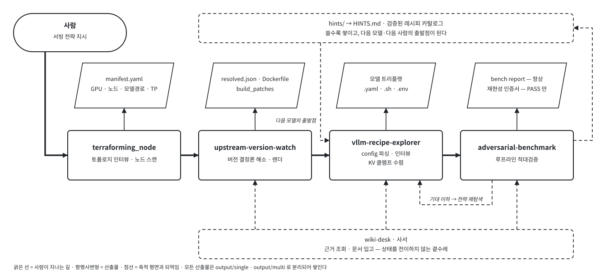
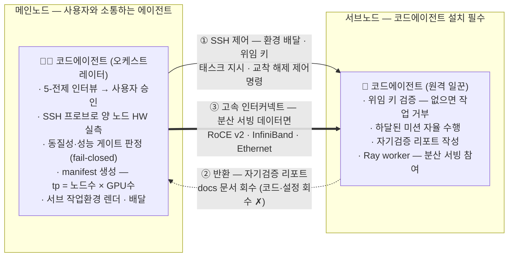
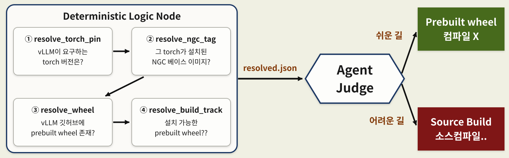
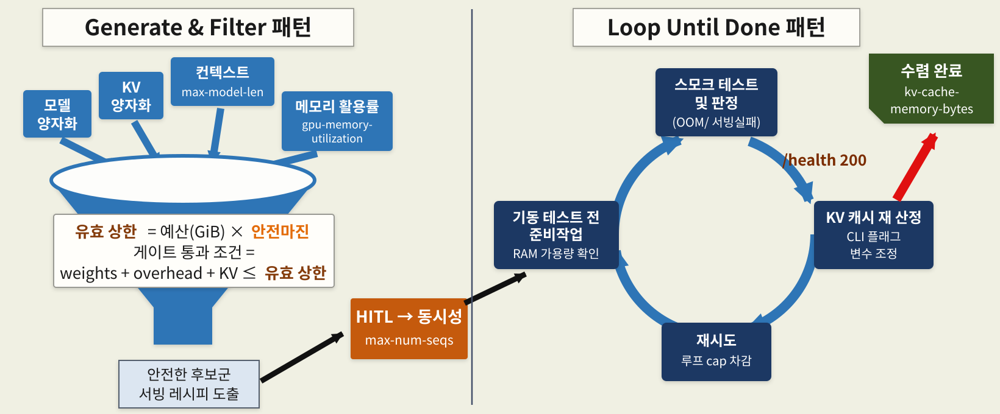
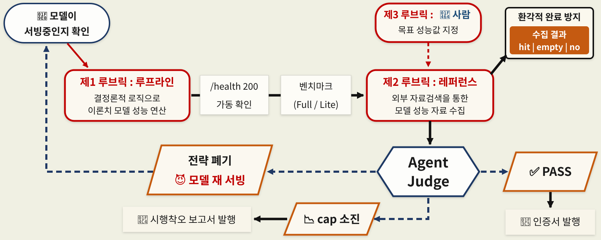
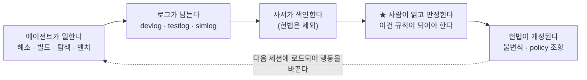

# easy-vllm

> **복잡한 로컬 LLM 서빙 절차를, 코드에이전트와의 협업으로 위임합니다.**
>
> *Upstream-tracking vLLM container & serving-strategy generator — a portable skeleton + generation engine + 타겟-GPU 서빙 시뮬레이터.*

---

## 프로젝트가 해결하고자 하는 문제

자체 LLM 호스팅 서버 구축 시 **동시 요청·고속 추론** 요구사항이 존재한다면 **vLLM**·SGLang·
TensorRT-LLM 등의 추론엔진을 사용해야 합니다. 이때 서버 구축을 수행하는 이는 두 가지 큰 난제를
만납니다.

1) **빌드** : vLLM 은 torch·CUDA·드라이버 의존 요구사항이 서로 맞물려 있어 **샌드박스(컨테이너)화**
   가 사실상의 구축 표준이라는 점.
2) **서빙** : 모델이 GPU 에 들어가고 성능까지 나도록 하는 **CLI 인자 조합**을 찾아내야 한다는 점.

이 두 가지 난제는 모델마다, vLLM 버전마다, GPU 아키텍처마다 **매번 다른 솔루션**을 요구하기에 —
한 번 성공한 노하우를 다음에 그대로 못 씁니다. 그래서 비전공자에게는 진입장벽이고, 전문가에게도
매번 반복되는 소모전입니다.

**easy-vllm 은 이 두 가지 문제를 코드에이전트에게 위임합니다.**



easy-vllm-simulator의 전체 프로세스 진행 도식

> 💡 **easy-vllm-simulator 개발 철학** : easy-vllm은 *완성된 컨테이너 + 서빙명령어 모음집* 이 아니라 **"스켈레톤 + 생성엔진"**입니다.<br/>
> 프로젝트는 골격, 계약 양식만 존재하며, *당신이 프로젝트를 클론하고 실행하는 순간 당신의 환경에 맞는 컨테이너 & 서빙명령어가 생성*됩니다.

---

## 1. 프로젝트 시작 : terraforming_node 스킬 구동

프로젝트 첫 클론 후 코드에이전트 호출 후 트리거 질문을 적습니다.

> 👤 **당신**: 이 프로젝트로 무엇을 시작해야 해?
>
> 🤖 **에이전트**: 먼저 *당신 환경*부터 봅니다. 이 프로젝트는 제가 당신 하드웨어에 맞춰 vLLM
> 컨테이너를 직접 설계하는 구조라서요. 그래서 환경 파악이 끝나기 전엔 제가 *일반 정보·조언*만
> 드립니다 — 당신 GPU·OS·모델 위치를 모르는 채로 "TP 8로 띄우세요" 같은 **근거 없는 답을 지어내지
> 않습니다.** (그건 실제 배포에서 사고로 이어졌고, 그래서 막아뒀습니다.)
>
> 당신 환경이 **노드 한 대**인가요, **여러 대**인가요?

이 대화를 시작으로 `terraforming_node` 가 작동합니다. 이 스킬이 하는 일은 셋입니다<br/>
**① 환경기술서 작성 · ② 안정성 장치(노드블랙박스) 설치 · ③ (노드가 여럿이면) 노드 간 통신체계 수립.**

---

### 1-1. HW 스캔 → 환경기술서(`manifest.yaml`) 작성

스킬 이름을 `테라포밍`으로 작성한 이유는 이 프로젝트가 *당신의 환경에 맞춰 프로젝트를 올바르게 기능하는 첫 단계*이기 때문입니다.<br/>
스킬의 산출물은 `manifest.yaml` 으로, 모든 런타임 스킬이 이 환경기술서를 바탕으로<br/>
**vLLM의 빌드 설정**, **모델 서빙전략**, **모델이 최적성능으로 기능하는지**를 판단합니다.

```yaml
# output/<topology>/manifest.yaml — 당신이 채우고, 모든 스킬이 읽는 단 하나의 계약서

# ── 하드웨어 사실 (대부분 자동탐지) ──────────────────────────────
topology: single              # → 산출물 통로를 가른다 (output/single | output/multi)
cpu_arch: "aarch64"           # → [빌드] NGC 베이스 이미지·manylinux wheel 선정 입력
cuda_version: "132"           # → [빌드] NGC 태그 해소 입력
gpus_per_node: 1              # → [서빙] tp = len(nodes) × gpus_per_node 로 산정
gpu_model: "NVIDIA GB10"      # → [서빙] VRAM 예산·KV 클램프 / [벤치] 루프라인 이론치

# ── ★ 이 세 줄이 시스템 전체의 스위치입니다 ──────────────────────
terraforming:
  complete: false             # false 면 빌드·서빙·벤치 세 스킬이 전부 **info-only** 로 잠깁니다
  branch_verified: false      # git 브랜치 ↔ topology ↔ 스캔결과 3자일치 통과 여부
  scanned_at: ""              # 검증 스캔 시각

# ── 모델을 어디서 가져올 것인가 (인터뷰로 확정) ──────────────────
model_source: managed         # managed(NAS read-only) │ ephemeral(컨테이너 임시) │ custom(지정경로)
nas_model_path: /mnt/models   # → [서빙] 컨테이너 /app/models 로 read-only 마운트되는 원본
hf_token_env_file: ""         # ⚠ 토큰 자체가 아니라, 토큰이 든 파일의 **포인터만** 둡니다

host_safety:
  installed: true             # 노드 블랙박스 설치 Y/N (1-2 에서 물어보는 그것)

# ── 여기서부터는 멀티노드일 때만 ─────────────────────────────────
interconnect:
  type: RoCE v2               # → [서빙] 분산 NCCL 경로 결정
  gid_index: 3
  bandwidth_gbps: 218         # → 성능 게이트 기준선 (합산 180 미만이면 fail-closed)
  platform_preset: dgx-spark-gb10
nodes:
  - role: main
    host: <IP_or_hostname>
    ssh_user: <user>
    work_dir: <레포 절대경로>   # → 배달·스모크 스크립트가 경로를 여기서 해소 (하드코딩 금지)
  - role: sub
    host: <IP_or_hostname>
    ssh_user: <user>
    work_dir: <레포 절대경로>
```

> 💡 `terraforming_node`는 환경기술서(`manifest.yaml`)를 작성하기 위해 사용자에게 HW 스캔 권한 요청을<br/>
> HITL(Human-In-The-Loop)로 수행합니다. 또한 기술서에 HW의 변동사항이 발생하면 이를 감지 후 기술서 개정을 요청합니다.

---

### 1-2. 노드 블랙박스 — 서빙 환경의 안정성 확보 (선택 · sudo)

환경기술서(`manifest.yaml`)의 작성이 완료된 후, 코드에이전트는 서빙 안정성 확보를 위해 사용자에게<br/>
**추천 제안 : 노드블랙박스의 설치**를 진행합니다. *이는 강제가 아니라 Y/N 선택사항입니다.*

> 🤖 **에이전트**: 끝으로 **노드 블랙박스**를 설치하시겠어요? 이름 그대로 *항공기 블랙박스*입니다 —
> 평시엔 조용히 기록하고, 사고가 나면 그 기록이 **유일한 증거**가 됩니다. GB10 같은 **통합메모리**
> 머신은 GPU 메모리가 시스템 메모리와 한 몸이라 *GPU OOM = 호스트째 다운*인데, 하드다운은 디스크에
> 로그를 쓸 시간조차 주지 않고 끝나거든요.
> — **discrete GPU(일반 PC)** 라면 GPU OOM 이 호스트를 죽이진 않으니 **건너뛰어도 됩니다.**

노드 블랙박스는 **3가지 레벨로 나뉜 감지기**를 설치하여 모델 서빙의 안정성을 확보 및 사후분석을 수행합니다.

| 레벨 | 재부팅 | 무엇을 수행하나? |
| --- | --- | --- |
| **L1** | 불필요 | 수집기(1초 샘플) · **ETA 워치독** · 이벤트 통합 · 로그 수명 집행 · earlyoom |
| **L2** | 불필요(peer 필요) | **netconsole** 교차 스트리밍 — 멀티노드 전용(단일은 `N/A` 로 정직하게 기록) |
| **L3** | 1회 | 사후 포착 = **efi_pstore** 확보 (crashkernel·ramoops **제거**) |

> 💡 `terraforming_node`가 제공하는 `노드 블랙박스`는 설치과정에서 사용자가 직접 입력하는 `sudo` 명령어 및 재부팅 절차를 요구합니다.<br/>
> **이때 `docs/request`에 요청문서가 발행되니 이를 참고하여 수행 바랍니다.**

---

### 1-3. 멀티노드 — 메인·서브 노드의 관리와 통신체계 : **환경·인터페이스**, **안전 불변식** 하네스

| 하네스 계층 | 멀티노드에서 이 자리에 있는 것 |
|---|---|
| **행동 규정** | 서브 페르소나(`CLAUDE.md`)는 얇게 — *무엇을 만들지*만 주고 *어떻게 만들지*는 안 정함 |
| **환경·인터페이스** | `manifest`의 `nodes[]`·`interconnect` · 서브 워크스페이스 렌더-배달 · 능력카드 · `tasks/<id>.json`("파일=세션") · 문서기반 상향 회수 |
| **안전 불변식** |  A2A 위임 키 · 성능 게이트 fail-closed · 동질성 하드블록 · 스코프드 권한 · 무단 스캔 금지 · 경로 자동신설 금지 |

멀티노드&분산처리 환경이 구현되면 `terraforming_node`스킬은 **환경·인터페이스**, **안전 불변식**과 관련된 상위의 하네스 엔지니어링이 본격적으로 기동하며,<br/>
오케스트레이터(메인노드) -- 워커(서브노드)의 관계로 [A2A(Agent2Agent)](https://a2a-protocol.org/latest/specification/) 통신체계를 모방해<br/>
오케스트레이터가 워커에 제어명령을 하달하고, 워커는 하달된 미션을 자율 수행한 뒤 수행 결과를 반환합니다.


여기서 중요한 설계가 하나 있습니다. **성능이 합격선에 못 미치면 에이전트는 fail-closed 로 멈춥니다**<br/>
manifest 를 만들지 않고, 비정상 종료합니다. "느린데 일단 진행"을 코드가 막습니다.<br/>
검증 안 된 분산 구성으로 나아가다 한밤중에 OOM 으로 깨는 일을 방지하는 거죠.

> 🔧 **통신속도가 합격선에 못 미친다면** — ConnectX-7 / RDMA 환경을 **HW → SW 순으로, 위에서부터** 점검하세요.<br/>
> **상위 계층이 깨져 있으면 하위를 아무리 만져도 대역폭이 살아나지 않습니다.**
>
> | 계층 | 점검 항목 | 확인 방법 |
> |---|---|---|
> | **① 케이블·물리 (HW)** | ConnectX-7 케이블/트랜시버 규격·양단 체결·손상, 포트 링크 LED | 육안 + LED, 재체결, `ethtool -m <iface>`(트랜시버) |
> | **② NIC PCIe 장착 (HW)** | PCIe **Gen5 x16** 으로 실제 협상됐는지(레인 다운 시 대역 반토막), NIC 펌웨어 | `lspci -vv` → `LnkSta:`, `flint -d <dev> q`(fw) |
> | **③ 링크 속도·MTU (Link)** | 포트가 기대 속도로 **Active** 링크업, 점보프레임(MTU) 양단 일치 | `ibstat`/`ibstatus`(rate·`State: Active`), `ip link`(mtu) |
> | **④ RoCE 구성 (Network)** | **RoCE v2** + 올바른 `gid_index`, 동일 서브넷·ping, **PFC/ECN(lossless)** 양단 일치 | `show_gids`, `ping`, `mlnx_qos -i <iface>`(PFC) |
> | **⑤ 드라이버·GPUDirect (SW)** | OFED/DOCA·RDMA 커널모듈 로드, **GPUDirect RDMA**(GPU↔NIC 직결), IOMMU/ACS | `rdma link`, `lsmod \| grep mlx5`, `nvidia-smi topo -m` |
> | **⑥ NCCL/RDMA env (SW)** | `NCCL_IB_HCA`·`NCCL_IB_GID_INDEX`·`NCCL_NET_GDR_LEVEL`, 컨테이너 `/dev/infiniband` 마운트·`memlock unlimited` | compose·env 확인, `NCCL_DEBUG=INFO` 로 실제 경로 진단 |
>
> 위 ①→⑥ 을 순서대로 통과시키고 다시 `ib_write_bw` 를 재보면 됩니다. (그래도 낮으면 ⑥의 벤치 파라미터 — bidirectional·QP 수·GID index — 자체를 의심)

---

## 2. 런타임스킬 : upstream-version-watch 를 통한 vLLM 컨테이너 빌드

torch·CUDA·드라이버 의존 요구사항을 준수하는 `vLLM 컨테이너`를 빌드하는 스킬은 `upstream-version-watch`로,<br/>
사용자가 **타겟 vLLM 버전**을 선정하면 아래의 결정론적 스크립트 4개가 순차로 기능하여 빌드 전략을 판정(혹은 제안)합니다.



| | 스크립트 | 무엇을 판정하나 | 무엇을 읽어서 판정하나 (권위) |
|---|---|---|---|
| **①** | `resolve_torch_pin.py` | 이 vLLM 이 요구하는 **torch 버전** | 업스트림 `pyproject.toml` 의 `[build-system].requires` |
| **②** | `resolve_ngc_tag.py` | 그 torch 를 실은 **NGC 베이스 이미지** | NGC 컨테이너의 `PYTORCH_BUILD_VERSION` (`buildx imagetools` — 레이어 pull 없음) |
| **③** | `resolve_wheel.py` | prebuilt **wheel 의 실재 여부와 URL** | GitHub Release **자산 목록 실조회** |
| **④** | `resolve_build_track.py` | **wheel 이냐 소스빌드냐** + `TORCH_CUDA_ARCH_LIST` | ①의 torch 핀 + `manifest` 의 GPU compute-capability |

---

### 2-1. 빌드 갈래길 판단

④ `resolve_build_track.py` 제안정보를 바탕으로 `쉬운 길 — prebuilt wheel`, `어려운 길 — Source build`을 선택합니다.

#### 1) 쉬운 길 — prebuilt wheel

`Dockerfile` 은 NGC 베이스 → apt 의존 → **wheel URL 로 pip install** → requirements → ray<br/>
순으로 흐릅니다. **컴파일이 없어 몇 분이면 끝납니다.**

#### 2) 어려운 길 — 소스빌드

**NGC 베이스에 내장된 torch 빌드버전**과 **타겟 vLLM 이 선언한 torch 버전**이 달라 ABI(Application Binary Interface)가 충돌한다면,<br/>
코드에이전트는 vllm 컨테이너를 빌드하기 위한 `Dockerfile.source-build`를 작성합니다.

`Dockerfile.source-build`는 아래의 순서를 통해 **직접 컴파일 작업**을 수행합니다.
```text
① FROM nvcr.io/nvidia/pytorch:<②가 해소한 태그>
② 소스빌드 키 가드 — (NGC 베이스 × vLLM 버전) 조합이 검증된 패치셋인지 확인
③ ARG VLLM_REPO · VLLM_REF · TORCH_CUDA_ARCH=<내 GPU 의 compute capability> · BUILD_JOBS
④ git clone --filter=blob:none ${VLLM_REPO} → ${VLLM_REF} 체크아웃
⑤ ★ use_existing_torch.py
        └ vLLM 소스의 torch 핀을 걷어낸다 → NGC 의 torch 를 그대로 쓴다
        ∴ 이 트랙에는 접두어 불변식이 적용되지 않는다 (벽을 우회하는 게 아니라 없앤다)
⑥ ★ build_patches_src/   ← pre 슬롯 (컴파일 전)
        └ vLLM 소스 수정. _C 재컴파일이 필요한 csrc 의 유일한 자리
⑦ ★ 컴파일 (ccache · TORCH_CUDA_ARCH_LIST=${TORCH_CUDA_ARCH})
⑧ ★ build_patches/       ← post 슬롯 (컴파일 후)
        └ 빌드-바깥 native 의존 설치 (lib·커널)
⑨ ray · PATH · 무결성 검증
```

---

### 2-2. 특별한 모델을 기동하기 위한 커스터마이징 vLLM 컨테이너 빌드작업

*타겟 vllm 컨테이너 빌드*가 성공해도, 이것이 **모델 서빙환경**을 보증하지 않습니다.

§2-1 과정은 `vllm._C` 를 **AOT(ahead-of-time)** 로 컴파일 하는 과정만 다룹니다.<br/>
그러나 일부 모델의 MoE·양자화 연산은 **서빙 시점에 커널을 골라 JIT(just-in-time)으로 컴파일**을 필요로 합니다.

JIT 과정은 GPU 아키텍처에 따라 달라지며, 커널라이브러리의 빌드를 요구합니다.

#### 모델의 요구사항 — 커널 가용성

모델은 **자기 연산을 실행할 커널이 내 GPU 아키텍처에 있는가**를 묻습니다.<br/>
아래는 MXFP4 양자화 MoE 모델을 DGX Spark GPU(sm_121a)로 서빙할 때 발생한 문제점에 대한 예시입니다.

| 모델이 요구하는 연산 | 그것을 실행할 수 있는 커널 | 내 아치에서 쓸 수 있나 |
|---|---|---|
| MXFP4 **MoE expert** | TRTLLM | ✗ SM100 데이터센터 전용 |
| ↳ | FlashInfer CUTLASS | ✗ SM90 전용 |
| ↳ | **Triton** | ○ 유일하게 가능 |
| ↳ | MARLIN (최후 폴백) | △ 동작하지만 위험 |
| **FP8 GEMM** | DeepGEMM (stock) | ✗ 해당 아치 실행커널 부재 |
| ↳ | DeepGEMM (`nv_dev` 브랜치) | ○ 네이티브 지원 |

이 표가 말하는 것이 **arch-wall** 입니다. vLLM 이 모델을 지원해도, **그 모델의 커널이 내 아치를 지원하지 않으면 서빙이 불가합니다.**<br/>
`upstream-version-watch`스킬은 위 문제를 해결하기 위해 **빌드 평면**에 3가지 패치를 추가합니다.

#### 빌드 평면에 추가하는 3가지 패치

**① 커널 라이브러리** — vLLM 은 attention·MoE·양자화 연산을 직접 구현하지 않고 외부 라이브러리에 위임합니다.<br/>
FlashInfer, DeepGEMM, Triton kernels, CUTLASS, humming-kernels등의 커널 라이브러리를 **backend**로 추가하며,<br/>
코드에이전트는 아래의 경로에 필요 라이브러리를 기술하여 컴파일을 진행합니다.

| 경로 | 무엇이 | 권위 |
|---|---|---|
| `requirements.txt` (pip) | `flashinfer-python` · `humming-kernels` · `nvidia-cutlass-dsl` | wheel METADATA 의 `Requires-Dist` |
| `build_patches/` (소스 빌드) | pip 로 안 되거나 내 아치 지원이 없는 것 — 예: DeepGEMM `nv_dev` | 패치 스크립트가 직접 clone·build |
| `build_lib_pins` | 릴리즈노트가 요구한 native-dep 핀 | `resolved.json` ledger |

**② 빌드 패치** — vllm 엔진의 소스나 그 주변을 직접 수정하며, 각각의 판정 근거는 아래와 같습니다.

| 고치려는 것 | 올바른 자리 | 틀린 자리에 두면 |
|---|---|---|
| vLLM 소스(Python/C++), `_C` 재컴파일 필요 | **pre** — `build_patches_src/` | post → 컴파일이 끝나서 **무효** |
| 빌드 바깥 native lib·커널 설치 | **post** — `build_patches/` | pre → 컴파일 결과에 의존하는데 그게 아직 없다 |
| Python processor/config shim | **런타임 패치**(§3) | 빌드 슬롯 → 모델별 값이 이미지에 굳는다 |

**③ 포크 SHA 핀** — 위 ①, ② 둘로도 안 되면 외부 자료검색으로 검증된 포크 SHA 핀을 사용합니다.

```text
deps 패치 → 소스-게이트 패치 → 자체 이식 → 포크 SHA 핀 → 체크포인트 교체
```

#### 멀티노드에서는 — 이미지가 아니라 빌드킷이 갑니다

노드가 둘이면 렌더 다음에 **서브 배달** 단계가 하나 더 붙습니다.<br/>
이때 **완성된 이미지를 보내지 않습니다.** 이는 완성된 이미지는 수십 GB 인데(실측 사례 49.7GB),<br/>
워커 에이전트는 빌드 전략 자율수립이 가능하기에 오케스트레이터(메인노드)와 빌드 동질성을 유지할 수 있는 **빌드킷**만을 수신합니다.

| 갈 것 (빌드 평면) | 안 갈 것 |
|---|---|
| `Dockerfile` · `Dockerfile.source-build` · `docker-compose.yaml` · `requirements.txt` | 루트의 템플릿·resolve 스크립트·`resolved.json` — **구조적으로 배제** |
| `build_patches/` · `build_patches_src/` | `.env.<model>` — 모델 트리플렛은 **전파 금지** |
| `.env.interconnect` · `.env.cluster` (토폴로지·네트워크 키드) | |

> 🕳️ 빌드킷은 앞서 설계한 A2A 통신체계를 응용한 SSH 방식으로 오케스트레이터 → 워커로 배달되며,<br/>
> 워커는 받은 빌드킷을 바탕으로 **자기 노드에서 직접 빌드**를 수행합니다.

---

## 3. 런타임스킬 : vllm-recipe-explorer 모델 서빙 전략 수립

§2 까지로 **모델을 실행할 커널이 갖춰진 컨테이너**가 생겼습니다. 그런데 컨테이너가 있다고 서빙 전략이 정해지는 건 아닙니다.<br/>
같은 모델·같은 이미지라도 *KV 캐시를 얼마나 줄지, 컨텍스트를 얼마로 할지, 동시요청을 얼마나 받을지* 에 따라<br/>
**OOM 이 나기도 하고 메모리를 절반만 쓰기도** 합니다.

사용자 레벨에서 알고 싶은 건 결국 셋입니다 — **제한된 메모리 예산** 안에서:

1) 모델에 할당 가능한 **context window** 는 얼마인지?
2) 동시에 몇 명이 접속(**concurrency**)할 수 있는지?
3) 토큰 생성 속도(**tok/s**)는 얼마나 나오는지?

`vllm-recipe-explorer` 스킬은 사용자의 요구사항(context window, concurrency)을 바탕으로 <br/>
**Generate & Filter + Loop until done** 패턴으로 최적의 모델 서빙전략을 수립합니다.

```text
  weights  +  overhead  +  KV   ≤   메모리 예산 × gpu-memory-utilization
     ↑           ↑          ↑
     │           │          └ per-token-KV × max-model-len × max-num-seqs
     │           └ 런타임·CUDA 그래프 등 (모델이 정하는 불변량)
     └ 모델 크기

  ∴  kv-cache-memory-bytes(결정되는 산출값)  =  예산 × gmu − weights − overhead
```
| 항 | 누가 정하나 |
|---|---|
| `weights` | 모델 크기 × **weight 양자화** |
| `overhead` | 모델·런타임이 정하는 불변량 (측정값) |
| `per-token-KV` | 모델 구조 × **KV 양자화** |
| `max-model-len` | **사용자 요구** — 위 1) context window |
| `max-num-seqs` | **측정 산물** — 위 2) concurrency 요구를 받아 실측 near-max 로 확정 |
| `gpu-memory-utilization` | HW(GPU)의 VRAM에서 사용자가 허용한 한도값(비율 단위) |
| `kv-cache-memory-bytes` | **결정되는 산출값**(**절대 바이트**) — 외부 이식 시 필요정보 |

> ⚠️ **weight 양자화**는 로드하는 모델의 양자화 정보 기준, **KV 양자화**는 모델 서빙 CLI 플래그를 통해서 결정



---

### 3-1. 모델 하나를 띄우는 다섯 자리 — 3+1+1 과 그 바깥

서빙전략 수립이 완료된 모델은 모델 트리플렛(3)과 런타임 패치(+1), 빌드 패치(+1) 그리고 그 외의 영역으로 구분하여,<br/>
`easy-vllm-simulator`가 완성한 산출물이 외부 환경에서 이식 가능한 형태로 패키징 됩니다.

#### 3개의 산출물 — 모델 트리플렛 (serve 시점)

익스플로러가 수렴을 마치면 **파일 세 개**를 냅니다. 셋이 한 벌이고, 하나만 있어도 서빙이 안 됩니다.

| 파일 | 담는 것 |
|---|---|
| `configs/<model>.yaml` | **vLLM serve 설정** — `max-model-len` · `max-num-seqs` · `kv-cache-memory-bytes` · `gpu-memory-utilization` · `kv-cache-dtype` · `tensor-parallel-size` · `speculative-config` · `reasoning-parser` · `tool-call-parser` … |
| `configs/<model>.sh` | **러너** — 모델별 사전처리 후 `vllm serve` 호출. 공통 러너가 `source` 로 불러들입니다 |
| `envs/.env.<model>` | **환경** — `SERVING_PORT` · `SERVING_MODEL_NAME` · `CONFIG_FILE` · 컨테이너명 · 그리고 변종이면 `VARIANT` 한 줄 |

`.yaml` 을 열면 §3 도입의 부등식이 그대로 값으로 앉아 있습니다 — `kv-cache-memory-bytes` 는 수렴된
절대 바이트, `max-num-seqs` 는 실측 near-max. **공식이 아니라 측정이 채운 자리**입니다.

> 🔒 **모델 트리플렛은 서브 노드로 전파되지 않으며,** 워커 노드도 자체 서빙전략을 기동해 HW환경에 최적화된 트리플렛을 자체 생산합니다.

#### 두번째 +1 — 런타임 패치 (serve 시점 · arming)

모델이 vLLM 및 PyTorch에 shim(얇은 호환/보정 코드)을 요구하는 경우가 있습니다.<br/>
이를 `<model>_patch.py, arm_patch.sh`로 패키징합니다.

| | 틀 (`arm_patch.sh`) | 내용 (`<model>_patch.py`) |
|---|---|---|
| 성질 | **결정론** | **확률론** — 에이전트가 참조-그라운디드로 생성 |
| 추적 | **추적됨** (메인 저작 빌딩블럭) | **비추적·휘발** |
| 하는 일 | 패치가 있으면 site-packages 에 `.pth` 한 줄을 써서 arming | 실제 몽키패치 로직 |

#### 마지막 +1 — 빌드 패치 및 바깥의 영역(포크 핀)

`upstream-version-watch` 스킬이 관리하는 `build_patches_src/` · `build_patches/`, 변종 이미지 태그 정보를 의미합니다.

#### 다섯 자리 한눈에

| 자리 | 언제 성립해야 하나 | owner |
|---|---|---|
| 트리플렛 3 (`.yaml`·`.sh`·`.env`) | **serve** | `vllm-recipe-explorer` |
| 런타임 패치 (`<model>_patch.py`) | **serve (arming)** | `vllm-recipe-explorer` |
| 빌드 패치 · **pre** (`build_patches_src/`) | **컴파일 전** | `upstream-version-watch` |
| 빌드 패치 · **post** (`build_patches/`) | **컴파일 후** | `upstream-version-watch` |
| (바깥) 포크 핀 · 변종 태그 | **빌드** | `upstream-version-watch` |

---

## 4. 런타임 스킬 : adversarial-benchmark 를 통한 적대적 검증

§3 에서 미뤄둔 질문 3)의 답이 여기 있습니다 — **토큰 생성 속도는 얼마나 나오는가.**

이 스킬은 단순히 속도를 *재는 것*이 아니라 **반대편에 서는 검사(Devil's Advocate)** 를 세워,<br/>
모델이 머신의 성능을 제대로 활용하여 서빙되는지를 검증합니다.

Devil's Advocate는 스킬의 기동 과정에서 *Self-enhancement Bias(자기 고양 편향)*를 막는 장치입니다.

---

### 4-1. 벤치마커 스킬 기동의 고정된 순서

`adversarial-benchmark`는 아래의 절차를 통해 측정 환경의 루브릭을 명확히 합니다. 

```text
① 게이트 확인      돌고 있는 serve 가 없으면 → 기동하지 말고 중단·보고
                      (이 스킬은 서빙을 띄우지 않습니다)
② 루프라인 (a)     결정론 이론치 산출 — R_fp · R_token · expected_achievable
③ 가동 확인        /health 200 으로만 판정. 로그 grep 금지(거짓양성)
④ 측정 M           벤치 실행 → warmup 폐기 + 엔진 로그 교차검증
⑤ 외부 레퍼런스 E  Devil's Advocate 가 검색 → 결과를 hit│empty│no 로 **기록**
                      (미시도 상태로 ⑥ 직행 금지)
⑥ 판정             결정론 규칙 게이트 → PASS │ REFUTE │ NEEDS_RUBRIC
⑦ 종결 발행        사람용 리포트(항상) + 재현성 인증서(PASS 일 때만)
```

이때 `② 루프라인`을 `④ 측정`보다 앞서 수행하여 측정 전에 루브릭을 확보합니다.<br/>
`⑤ 외부 레퍼런스`도 검색결과를 `hit│empty│no`로 구분하여 *Illusory Completion (환각적 완료)*를 방지합니다.

---

### 4-2. 3중 루브릭

`adversarial-benchmark`는 총 3가지 루브릭을 설정하여 측정값 `M`을 검증합니다.

| | 기준 | 성질 |
|---|---|---|
| **(a)** | **루프라인** — 하드웨어 대역폭·연산으로 계산한 이론 상한 | 결정론 (spec decoding 인지) |
| **(b)** | **E — 외부 레퍼런스** | 같은 모델·비슷한 HW 의 커뮤니티 실측치 |
| **(c)** | **c — 사용자 목표** | *"나는 30 tok/s 면 된다"* |

---

### 4-3. 판정과 대응전략 수립



**세 가지가 이 그림의 요점입니다.**

**① 권한은 상수만 고릅니다.** 약한 권한이든 명시적 권한이든, **판정 자체는 결정론 규칙**이 합니다 —
LLM 다수결이 아닙니다. 권한은 *어느 값을 기준선으로 쓸지*만 정합니다. 그리고 **트리거는 사용자만
당깁니다** — 에이전트가 스스로 명시적 권한을 선언할 수 있으면 목표를 낮춰 검증을 우회할 수 있으니까요.

**② 두 가지 실패가 다른 길로 갑니다.** 루브릭을 **못 세운 것**(모른다)은 사용자에게 묻고, 루브릭을
**못 충족한 것**(느리다)은 다시 해봅니다. 섞으면 처방이 엉뚱해집니다.

**③ 인증서는 PASS 에서만 나오고, 리포트는 항상 나옵니다.** 그래서 *FAIL 인증서*가 구조적으로 존재할
수 없고, 동시에 **실패도 기록으로 남습니다.** 통과율이 아니라 이 비대칭이 게이트가 일하고 있다는
증거입니다.

> ⚠️ **무한 기각도 무한 루프도 금지입니다.** 적대적 검사가 상한 없이 기각을 반복하면 그건 검증이
> 아니라 마비입니다. 그래서 재탐색에 상한을 두고, 소진되면 사람에게 넘기거나 정직하게 기각을
> 남깁니다.

---

## 5. wiki-desk와 문서 작성 규칙

§1~§4 는 *일을 하는* 스킬이었습니다. §5 는 **기록을 다루는** 스킬입니다.

이 프로젝트는 **"로그가 곧 에이전트"** 라는 원칙이 있습니다 — 작업은 문서 발행으로 잔존하고,<br/>
발행되지 않은 작업은 다음 세션에서 존재하지 않습니다. 그런데 문서가 쌓이면 반대 문제가 생깁니다.<br/>
**찾을 수 없어집니다.** `wiki-desk` 는 그 문제만 담당하는 사서입니다.

---

### 5-1. docs 의 여덟 서랍 — 무엇을 어디에 넣나

문서는 역할로 갈립니다. **같은 사실도 어느 서랍에 있느냐로 무게가 달라집니다**(§5-3).

| 서랍 | 역할 | 언제 쓰나 |
|---|---|---|
| `plan/` | 실행 **전** 의도 — 목표·범위·단계·리스크·합격기준 | 착수 전 사람 검토용 |
| `devlog/` | 작업 중·후 **서사** — 결정·시도와 폐기·최종 상태·재개 지침 | 무엇을 했는지 남길 때 |
| `testlog/` | **판정** — 명령·관측·환경 스냅샷·PASS/FAIL | 검증 결과를 못 박을 때 |
| `simlog/` | **원시 trial vault** — trial 별 로그·프로파일·후보 | §3 트라이얼마다 (기계 생성) |
| `benchmark/` | full 계측 — 리포트는 항상, 인증서는 PASS 만 | §4 종결 시 |
| `report/` | 배포자 공지 — 자기완결 HTML/MD | 사람이 외부에 알릴 때 |
| `request/` | **사람 수행 지시서** — 에이전트가 닿을 수 없는 평면의 과업 | sudo·재부팅·물리 작업 |
| `logs/` | **기계판독 데이터 평면** — 노드 블랙박스 시계열·이벤트 | 상시 (사람 가독성 미고려) |

**이름은 규약으로 고정됩니다** — `docs/<종류>/<종류>_<YYMMDDHH>_<주제>.md`. 같은 시각에 충돌할
때만 분·초를 덧붙이고, **상대 날짜·평면 배치·순번 접미는 금지**입니다. 이름이 규칙이면 나중에 사람도
스크립트도 같은 방식으로 찾을 수 있습니다. (`logs/` 만 예외입니다 — 문서가 아니라 데이터라서요.)

**추적 여부도 규약입니다.** 작업 산출물은 **전부 git 에서 제외**되고, 폴더 구조를 알려주는
`example.md` 스켈레톤만 추적됩니다. **유일한 예외가 `report/`** — 그건 애초에 배포용이니까요.
그래서 당신의 실측값·경로·판정이 남의 레포로 흘러가지 않습니다.

그리고 문서들은 **증거 사슬**로 이어집니다:

```text
simlog (원시)  →  benchmark (계측)  →  testlog (판정)  →  devlog (서사)
```
---

### 5-2. `wiki-desk` — 문서는 참조형태로만 관리

`wiki-desk` 는 프로젝트 루트에 `__llm-wiki/` 를 만듭니다(**비추적**). 색인 대상은
`docs/{devlog,testlog,plan,simlog}` + 서브 노드 문서 미러 + `seed/` 입니다.

핵심 제약이 하나 있습니다 — **원문을 복사하지 않습니다.** 색인에 들어가는 건 **경로 참조 ·
sha256 · 역할 · 권위 등급 · 관계 엣지**뿐입니다. 그래서 사서는 답을 이렇게 줍니다:

> *"그건 `docs/testlog/testlog_…` 에 있고, 그 판정은 `docs/plan/plan_…` 을 실현한 것이며,
> 원시 근거는 `docs/simlog/…` 입니다."*

내용을 옮겨 적는 대신 **어디를 보라고 알려주며,** **그럴듯한 경로를 지어내지 않습니다.**
존재하지 않는 문서를 인용하는 것이 이 사서의 유일한 치명적 실패 양상이라, 거기에 fail-closed 를 걸어뒀습니다.

---

### 5-3. 문서의 무게가 다릅니다 — 권위 랭킹

같은 주제를 다룬 문서가 여럿이면, 사서는 **무게 순으로** 내놓습니다.

```text
devlog 100  >  testlog 85  >  서브 문서 70  >  plan 55  >  simlog 40  >  seed 25
```

원리는 한 문장입니다 — **실행 진실 > 계획 의도.**

> *실제로 기동했던 `devlog` 가, 의도만 적혀 있는 `plan` 을 이깁니다.*

이를 통해 `easy-vllm-simulator`는 **에이전트가 모델 서빙하는 여정을 어떻게 최적화 해야하는지를 추측이 아니라 결정론적 기록을 기초**로 계획합니다

---

## 6. 헌법과 참여형 루프 엔지니어링

§1~§5 는 **에이전트가 무엇을 하는지**였습니다. §6 은 **당신이 무엇을 하는지**입니다.

그리고 이 프로젝트에서 당신이 하는 일은 하나로 수렴합니다 — **헌법을 쓰는 것.**

`CLAUDE.md`(목표·불변식·안전 경계·트리거) · `.claude/rules/`(절차 계약) ·
`.claude/policies/`(정책 13종 · 조항 56개). 이것이 이 프로젝트의 헌법이고,
**에이전트가 아니라 사람이 씁니다.** 왜 그래야 하는지가 이 장의 내용입니다.

| 층 | 경로 | 규모 | 성격 | 로드 시점 |
|---|---|---|---|---|
| **L1 · 항상 참인 경계** | `CLAUDE.md` | 136줄 | 목표 · 불변식 · 안전 경계 · 트리거 · 정책 경계 · 조건부 참조 | **매 세션 자동** |
| **L2 · 절차 계약** | `.claude/rules/workflow.md`<br/>`.claude/rules/docs.md` | 170줄<br/>146줄 | 상태·owner 표 · S1~S4 전이 spine · 실패 라우팅<br/>문서 8종 규약 · 명명 SSOT · 보관·전파 matrix | **필요할 때 참조** |
| **L3 · 집행 장치** | `.claude/policies/` | 정책 13종<br/>조항 56개 | 정책 원장 · 코드 바인딩 · 판정 술어 · 런타임 게이트 | **스크립트가 실행 중 소비** |

L3 는 헌법이 **집행 가능해지는** 층입니다. 구성은 이렇습니다.

| 파일 | 무엇을 담나 |
|---|---|
| `registry.yaml` | ★ **정책 원장** — 정책 13종 · 조항 56개. 각 정책이 `owner`(집행 책임 스킬)와 `origin_failure`(자신을 낳은 실패 문서 ID)를 갖는다 |
| `claim_bindings.json` | ★ **조항 → 코드 바인딩** — 조항 하나하나가 실제 파일 경로 + `assertion_id` 로 묶인다 |
| `predicates/` | **판정 술어 3종** — 조항 준수 여부를 기계가 판정하는 함수 |
| `runtime/` | **런타임 게이트 8종** — `completion_gate` · `evidence_publisher` · `harness_verify` · `verify_distribution` 등 |
| `governed_prose_snapshot.json` | ★ **헌법 산문의 변경 감지 tripwire** — `CLAUDE.md` · `workflow.md` · `docs.md` · `references.md` |
| `tracked_index.json` | 배포 추적물 86건의 무결성 기준 (git index = provenance 권위) |
| `arch_variant_ledger.json` | arch-wall 변종 좌표 원장 (§2-2) |
| `evidence_manifest.json` · `provenance/` | 조항이 근거로 삼은 승인 문서·증거 |
---

### 6-1. 이해는 검증이 아니라 참여를 위한 것

> *"이해해야 하는 더 깊은 이유가 있습니다. 검증하기 위해서가 아니라 **참여하기 위해서**입니다."*
> — Jeffrey Litt, *"코드를 이해하는 것"이 새로운 병목입니다* (AI Engineer, 4:08)

**검증(verify)** 은 "에이전트가 바보짓 안 했나" 를 확인하는 일입니다. 그리고 그 역할은 **실제로 줄어들고 있습니다** <br/>
검증 루프와 결과에 대한 평가체계만 수립하면 Agent는 목표를 어쨌든 달성합니다.

그러나 **참여(participate)** 는 다릅니다.

> *"당신이 무슨 일이 벌어지는지 이해한 것이, **다음 아이디어를 갖는 토대**이고 프로젝트의
> 능동적이고 창의적인 참여자가 되는 토대입니다."* — 같은 발표, 4:32

★ 그리고 이 프로젝트에는 그 말이 특별히 강하게 적용되는 이유가 있습니다. 헌법에 이런 불변식이
있습니다:

> *"모델별 서빙전략은 이전 모델의 전략과 완전히 달라질 수 있다 — **carry-forward 를 절대 하지
> 않는다.** 정답은 모델·하드웨어 조합마다 참조-그라운디드로 재확정한다."*

즉 **에이전트는 지난 모델의 답을 다음 모델로 가져가는 것이 금지돼 있습니다.**<br/>
매번 §3 의 탐색 루프를 처음부터 다시 탐색하고, 목표달성을 위한 여정을 밟아갑니다.

여기서 **사람은 답이 아니라 이해를 가져야 합니다.** 프로젝트가 달성하고자 하는 궁극의 특이점

1) 전혀 정보가 없는 새로운 모델을 3+1+1 산출물 규약에 맞춰 커스텀 vllm 컨테이너를 빌드하고 서빙하는 에이전트
2) 모델 호스팅 서버의 다양한 위기상황에 자율적으로 대응 가능한 에이전트

을 도달하기 위해서는 **사람이 루프에 참여하여 프로젝트를 함께 발전시켜 나가야 합니다.**

---

### 6-2. 헌법의 작성 및 관리주체 : 사람

§5 `wiki-desk`는 **헌법을 의도적으로 색인하지 않습니다**
`wiki-desk`가 헌법의 색인을 수행하면 순환 참조와 확증 편향의 문제가 발생합니다. 



위 거대한 루프에서 **네 칸은 에이전트가 합니다. `★` 만 사람이 합니다.**<br/>

#### 왜 그 판정을 사람이 해야 하나? - LLM은 '귀추(Abduction)'할 수 없다.

| 추론 | 형태 | 하는 일 | 이 프로젝트에서 |
|---|---|---|---|
| **연역**(deduction) | Rule + Case → Result | 규칙을 사례에 적용해 결과 도출 | **결정론 스크립트** — 버전 해소, 실패 분류기, 게이트. 이미 기계화됨 |
| **귀납**(induction) | Case + Result → Rule | 사례와 결과에서 통계적 규칙 학습 | **사서의 색인·블랙박스 롤업** — 로그의 압축. 기계화됨 |
| **귀추**(abduction) | Rule + Result → **새 Case, 또는 새 Rule** | 예상 못한 결과를 설명할 원인·규칙을 **발명** | ★ **사람의 `판정`** — 아직 여기 남아 있습니다 |

연역은 "진리를 보장하는 분석"이고 귀납은 "데이터의 압축"입니다. 둘 다 `easy-vllm-simulator`의 에이전트에 위임된 작업입니다.<br/>
그러나 귀추는 "예상치 못한 결과로부터 새로운 Rule 을 제정하는 것", LLM은 **직관적 점프(J)**를 달성하지 못했습니다.

> *"연역은 공리를 만들지 못함."*
> *"모순을 찾아내는 것과 올바른 공리를 발명하는 것은 별개의 문제임."*

> ✍️ 프로젝트가 여러분이 달성하고자 하는 개인화된 Agent로 온전하게 기능하기 위해서는 여러분의 직관이 새로운 헌법과 새로운 스킬로 구현되어야 합니다.

---

## 닫는 글 및 개발자 노트

프로젝트는 다양한 HW머신에서 로컬LLM을 호스팅하는 문제를 <br/>
5가지 서로 다른 성격(하네스/루프/그래프)의 스킬의 배치와 <br/>
이를 **사람이 계속 재설계하는 참여형 루프 엔지니어링**으로 해결합니다.

프로젝트의 주 실험 HW는 DGX Spark - 멀티노드 환경(NCCL 기반 분산처리)에서 진행되었으나, <br/>
프로젝트의 범용성 및 확장성을 고려하여 ① Windows - WSL 기반 우분투 (RTX5090), <br/>
② Ubuntu 22.04 (RTX PRO 6000) 등의 시스템에서 모델 서빙이 실제로 이뤄지는지 확인했습니다.

---

### 부록 A — hint 태그와 토큰노믹스 (Tokenomics)

이 프로젝트는 **완제품을 배포하지 않습니다.** 프로젝트의 구성품은 스켈레톤 + 생성엔진이고,<br/>
모델 서빙을 위한 여정은 당신이 코드에이전트와 협업하여 새로이 밟아 나아가야 합니다.<br/>
이 과정에서는 **Token**이 소비됩니다. 프로젝트는 기본 Code Agent로 claude code - Opus 시리즈를 주로 사용했으나,<br/>
모델 서빙에 관한 여정은 Sonnet, Kimi K3, MiniMax M3 등의 모델로도 달성 가능함을 확인했습니다.<br/>

그러나 `easy-vllm-simulator`는 모델 서빙 여정이 근거에 대한 **탐색**,<br/>
목표 달성을 위한 **반복 시도**가 주를 이루고 있어<br/>
토큰 소비가 꽤 많이 발생하는 구조입니다.

따라서 배포자는 AI Tokenomics Foundation의 철학을 바탕으로 `HINTS.md`를 운영합니다.

> *"AI Tokenomics is the discipline of converting energy and capital into AI, then efficiently
> consuming AI services to enable intelligent outcomes and drive business value."*
> — [tokeneconomics.com](https://www.tokeneconomics.com/)

배포자는 모델 서빙을 진행하면서 1) 검증된 성공이력, 2) 가치있는 시행착오 이력에 대한 지식을 배포합니다.<br/>

```text
hint/<vllm버전>/<모델>/<arch>
     0.26.0  / deepseek-v4-flash-0731 / gb10x2
```

> 🗺 **hint 는 정답이 아니라 지도입니다.** *"이 버전, 이 모델은 대략 이 방향으로, 이 벽
> 순서로 뚫렸다"* 는 곁눈질입니다. 당신의 하드웨어가 다르면 **노브는 반드시 재도출**해야
> 합니다 — 특히 **KV 절대값 · `gpu-memory-utilization` · `TORCH_CUDA_ARCH_LIST`** 를 그대로
> 복사하면 OOM 이나 호스트 다운으로 갑니다.

#### A-0. hint 태그 사용방법

```bash
# 2) 내 상황에 가까운 것 찾기 (축별 근-미스를 결정론으로 알려줍니다)
python3 .claude/skills/hint-publisher/scripts/hint_tag.py match \
  --vllm 0.27.0 --model qwen3-4b --arch gb10
```

```bash
# 3) 레시피 본문만 뽑아 seed/ 에 저장
#    ※ git show <tag> 는 커밋 diff 까지 딸려옵니다 — 아래 --format 을 쓰세요
mkdir -p seed/hints
git tag -l --format='%(contents)' hint/0.26.0/deepseek-v4-flash-0731/gb10x2 \
  > seed/hints/deepseek-v4-flash-0731.md
```

**4) 코드에이전트에게 이렇게 말합니다:**
> *"`seed/hints/deepseek-v4-flash-0731.md` 를 읽고, `vllm-recipe-explorer` 인터뷰의
> warm-start 근거로 넣어서, 평소대로 plan → 레시피 수렴 → 스모크 게이트를 밟아 전략을
> **다시** 세워봐."*

#### A-1. hint 태그 — 시행착오도 발행합니다

배포자는 **성공 이력만 발행하지 않습니다.** 실패했거나, 기대에 못 미쳤거나, 나중에 틀린 것으로
드러난 이력도 그대로 태그로 냅니다. 왜 그러는지가 이 절의 내용입니다.

##### 왜 — 안티패턴이 열쇠이기 때문입니다

UC Berkeley 의 Frank Coyle 이 Anthropic CCA 시험을 *필드가이드*로 읽으며 한 말이 이 방침을
가장 정확하게 설명합니다.

> *"We now have patterns for agents, but there's also **anti-patterns**. And I think
> anti-patterns are a key to understanding what you should not do — because understanding
> what you should not do is the key to leading you to what you should do."*
> — Frank Coyle, *Anthropic's CCA Exam as a Field-Guide for Agentic Engineering*

**LLM 서빙은 안티패턴이 유난히 비싼 분야입니다.** §A 앞머리에서 본 것처럼 토큰 비용은 에이전트
깊이에 따라 가파르게 오르는데, 그 토큰의 대부분이 **"이 길이 막혔는지 확인하는 데"** 쓰입니다.
그러니 *"거긴 막혔다"* 는 정보는 *"여기로 가면 된다"* 만큼 값이 나갑니다.

#### 무엇이 실제로 들어 있나 (2026-08-18 기준)

카탈로그 **41개 항목 중 13개**가 성공담이 아닙니다.

| 유형 | 개수 | 태그가 말하는 것 | 예 |
|---|---|---|---|
| **성능 REFUTE** | 5 | 서빙은 됐지만 **성능 게이트를 통과 못 했다** — 원인까지 명시 | `hint/0.25.1/gpt-oss-120b/rtxpro6000` — MARLIN mxfp4 **커널 천장** |
| **정정판** | 1 | 앞 태그에 결함이 있었고 무엇이 틀렸는지 | `hint/0.27.0/LFM2.5-2.6B/gb10-v2` — 앞 태그는 파서 미설정 |
| **가설 반증** | 1 | **배포자 자신의 판단이 틀렸음**을 기록 | `hint/0.26.0/deepseek-v4-flash-0731/gb10x2` — "DSpark arch-wall" 가설이 반증됨 |
| **구조적 불가** | 3 | 그 조합은 **그 스택으로는 안 된다** | `…/gb10x2-dspark-1m` — stock 으로는 spec 경로 2개가 서로 다른 이유로 막힘 |
| **자기검증 실패** | 2 | 절차상 놓친 것을 스스로 잡은 기록 | `hint/0.23.0/gemma-3-1b-it/…` — batch 미최대화(20 → 재계산 55) |
| **업스트림 회귀** | 1 | 버전이 올라가며 **되던 게 안 되기 시작**한 지점 | `hint/0.24.0/gpt-oss-120b/…` — `moe-backend=auto` 회귀 |

또한 vLLM의 버전이 업데이트 되거나, 코드에이전트에 충분한 루프 엔지니어링이 수행되면서 과거의 성공사례보다<br/>
더 나은 모델 서빙이 성공한 사례가 존재하기도 합니다.

> *"Nothing is a mistake. There's no win and no fail. There's only make."*

hint 태그는 정답이 아닌 이유를 설명하는 자료입니다. 배포자는 이유가 토큰노믹스와 서빙 품질 두 가지를 달성하는 키라 생각합니다.

---

### 부록 B — 검증된 모델 서빙·사용 매뉴얼 (코드에이전트 없이)

여기까지는 *코드에이전트가 당신 환경에 맞춰 빌드·검증하는* 이야기였습니다. 하지만 **에이전트가
한 모델의 사이클을 이미 끝내 둔 뒤**라면, 그 모델을 날마다 띄우고·쓰고·내리는 **운용에는
에이전트가 필요 없습니다.** `docker` 와 `curl` 이면 됩니다. 토큰도 안 씁니다.

> 🔑 **역할 구분** — 에이전트는 *레시피를 만들고 검증*합니다(창의적·비결정론적). 당신은 그
> 검증된 레시피를 *운용*합니다(반복적·결정론적). 아래 명령은 전부 사람이 직접 칩니다 —
> `multinode_serve_smoke.sh` 도 코드에이전트가 아니라 **bash 스크립트**입니다.

### B-0. 전제 — "이미 검증된 레시피"란

아래가 갖춰진 모델에만 적용됩니다(= 에이전트가 §1~§3 을 끝낸 상태):

- ✅ 테라포밍 완수 Flag · ✅ 노드에 이미지 빌드됨
- ✅ 트리플렛 3종 — `configs/<config>.yaml` · `configs/<config>.sh` ·
  `output/<topology>/envs/.env.<config>`

아직 검증 전이라면(새 모델 · 새 vLLM 버전 · HW 변경) 노브(KV·`gmu`·TP·백엔드)를 다시 도출해야
하므로 **§2~§4 로 돌아가세요.** 이 부록은 *탐색*이 아니라 *운전*입니다.

### B-1. 내 브랜치가 어느 쪽인지부터 확인합니다

이 프로젝트는 **브랜치가 곧 산출물 통로**입니다. 단일/멀티가 섞이지 않도록 갈라놨습니다.

```bash
git branch --show-current      # single-node  또는  multi-node
ls output/                     # single/ 또는 multi/ — 내 통로
```

| 브랜치 | 통로 | compose 파일 | 기동 방법 |
|---|---|---|---|
| `single-node` | `output/single/` | `output/single/docker-compose.yaml` | **docker compose 직접** |
| `multi-node` | `output/multi/` | `output/multi/docker-compose.yaml` | **결정론 스크립트 경유** |

> ⚠ 브랜치를 바꾸면 `output/` 의 compose·Dockerfile 이 함께 바뀝니다. **서빙 중에는 브랜치를
> 전환하지 마세요** — 돌고 있는 컨테이너의 정의 파일이 사라집니다.

### B-2. 내 서빙 자산 확인

```bash
ls output/*/envs/.env.*          # 검증된 config 목록 (.env.<config> 의 <config> 가 이름)
docker images | grep easy-vllm   # 이 노드에 빌드된 이미지

# 접속에 쓸 값은 그 config 의 .env 안에 있습니다
grep -E '^(SERVING_PORT|SERVING_MODEL_NAME|IMAGE_TAG)=' output/<topology>/envs/.env.<config>
#   SERVING_PORT=8941  ·  SERVING_MODEL_NAME=<모델명>   ← 아래 <PORT> · <MODEL>
```

---

### B-3. 단일노드 (`single-node` 브랜치)

compose 하나로 자기완결적으로 뜹니다. **`--env-file` 이 필수**입니다 — compose 안의
`${CONFIG_FILE}` · `${SERVING_PORT}` · `${IMAGE_TAG}` · `${NAS_MODEL_PATH}` 가 그 파일에서
채워지고, 빠지면 전부 기본값으로 떨어져 **엉뚱한 이미지·포트로 뜹니다.**

#### 띄우기

```bash
docker compose -f output/single/docker-compose.yaml \
  --env-file output/single/envs/.env.<config> \
  --profile serve up -d
```

#### 준비 확인

```bash
docker logs -f ${CONTAINER_NAME:-vllm-serve-container}   # Ctrl+C 로 로그만 빠져나옴(컨테이너는 유지)
curl -s localhost:<PORT>/health                          # HTTP 200 이면 준비 완료
```

> 모델 크기에 따라 로드가 수 분 걸립니다. `/health` 가 200 을 줄 때까지는 **정상적으로 로딩
> 중**입니다 — 조급하게 다시 띄우지 마세요(메모리를 두 배로 씁니다).

#### 내리기

```bash
docker compose -f output/single/docker-compose.yaml \
  --env-file output/single/envs/.env.<config> \
  --profile serve down
```

#### 🔒 단일노드에서 반드시 아셔야 할 안전 경고

`docker compose` 직접 기동은 **서빙 예산 선언을 하지 않습니다.** 예산 선언은 에이전트 경로
(`run_trial.py`)에만 배선돼 있습니다. 무슨 뜻이냐면:

| 보호 장치 | 직접 compose 기동에서 |
|---|---|
| 호스트 상주 메모리 워치독(systemd) | ✅ **작동** — 설치했다면 vLLM 프로세스 전반을 감시 |
| 컨테이너 `oom_score_adj=800` | ✅ **작동** — compose 에 박혀 있음 |
| **로드 전 RAM 게이트**(체크포인트 대비 여유 검사) | ❌ **없음** |
| **선언된 바닥**(대형 로드를 정상으로 인정하는 ETA 예산) | ❌ **없음** |

즉 **검증된 레시피를 그대로 쓰는 한 안전**하지만, 노브를 손으로 바꿔(특히 `gpu-memory-utilization`
상향, `max-model-len` 확대) 띄우면 **로드 전 게이트가 잡아주지 않습니다.** 통합메모리 노드에서는
그것이 곧 호스트 하드다운입니다. 노브를 바꾸려면 §3 의 에이전트 경로로 돌아가세요.

---

### B-4. 멀티노드 (`multi-node` 브랜치)

마스터(로컬 · Ray head + vllm serve)와 슬레이브(서브 SSH · Ray worker)가 **둘 다** 떠야 합니다.
그래서 `docker compose` 를 직접 치지 않고 **결정론 스크립트**를 씁니다 — 그 스크립트가
NAS 체크 → 예산 선언 → 워치독 → 양노드 기동 → health 폴링 → 스모크를 한 번에 처리합니다.

#### 띄우기 (상주)

```bash
READY_MAX=600 bash .claude/skills/upstream-version-watch/scripts/multinode_serve_smoke.sh <config> --keep-up
```

- `--keep-up` — 스모크 후에도 컨테이너 **유지**(빼면 스모크 뒤 자동 정리)
- `READY_MAX` — health 폴링 시도 횟수(기본 180). 큰 모델은 넉넉히 주세요
- 완료 신호는 **`READY ~Ns` + `SMOKE PASS`** 두 줄입니다

#### 🔴 내리기 — `docker compose down` 을 직접 치지 마세요

```bash
bash .claude/skills/upstream-version-watch/scripts/multinode_serve_smoke.sh <config> --down
```

**이건 취향이 아니라 실측된 함정입니다.** 정상 teardown 은 다섯 단계입니다 —
① 마스터 down ② 슬레이브 down ③ 워치독 정지 ④ drop-caches ⑤ **예산 회수**.
`docker compose down` 은 ①②만 하고 **뒤 셋을 조용히 빠뜨립니다.**

> 실제로 벌어진 일(2026-08-15): 그렇게 내린 뒤 재기동에서 **stale 선언**이 남아 `clear` 와
> `declare` 가 같은 초에 실행됐고, 1초 주기 워치독이 그 사이의 `none` 을 관측하지 못해
> `declare_not_honored` 로 **진입이 차단**됐습니다. 회수 경로를 건너뛴 대가를 *다음 기동*이
> 치른 것입니다.

#### 자주 쓰는 플래그

| 플래그 | 언제 |
|---|---|
| `--build` | 이미지를 다시 빌드해야 할 때(양노드 병렬) |
| `--build-only` | **빌드만** 하고 종료 — 로드 전 RAM 게이트를 타지 않습니다(빌드는 가중치를 안 올리니까요) |
| `--keep-up` | 스모크 후 상주 |
| `--down` | 상주분 회수(**유일한 정식 teardown**) |
| `--no-budget` | 예산 선언 생략 — **무보호 진입**. 진단용이며 생략 사실이 로그에 남습니다 |

#### 종료 코드

| 코드 | 뜻 |
|---|---|
| `0` | 스모크 통과 |
| `2` | 미준비 / 스모크 실패 |
| `3` | NAS·설정 실패 (RAM 게이트 거부 포함) |
| `4` | **예산 선언 실패 — 로드는 0초도 시작하지 않았습니다** |

`4` 는 사고가 아니라 **정상 차단**입니다. 우회하지 말고 `--down` 으로 이전 상주분을 정리한 뒤
다시 띄우세요.

---

### B-5. 접속·사용 (양쪽 공통)

`<PORT>` = `SERVING_PORT`, `<MODEL>` = `SERVING_MODEL_NAME`(B-2 에서 확인).
**OpenAI 호환 API** 라 기존 OpenAI 클라이언트가 그대로 붙습니다.

```bash
curl -s localhost:<PORT>/health      # 200 이면 준비 완료
curl -s localhost:<PORT>/v1/models   # 서빙 중인 모델명 확인
```

```bash
curl -s localhost:<PORT>/v1/chat/completions -H 'Content-Type: application/json' -d '{
  "model": "<MODEL>",
  "messages": [{"role":"user","content":"안녕, 자기소개 해줘"}],
  "max_tokens": 256
}'
```

```python
# 로컬 서빙은 API 키를 검사하지 않으니 아무 문자열이나 넣습니다
from openai import OpenAI
client = OpenAI(base_url="http://localhost:<PORT>/v1", api_key="not-needed")
r = client.chat.completions.create(
  model="<MODEL>",
  messages=[{"role": "user", "content": "안녕"}],
)
print(r.choices[0].message.content)
```

> 💡 다른 기기에서 붙이려면 `localhost` 를 서빙 노드 IP 로 바꾸면 됩니다. 다만 이 서버는
> **인증이 없습니다** — 신뢰할 수 있는 네트워크에서만 여세요.

### B-6. 상태·로그

```bash
docker ps --filter name=vllm                    # 떠 있는 컨테이너
docker logs --tail 100 <container>              # 최근 로그
nvidia-smi                                      # GPU 점유
free -h                                         # 통합메모리 노드는 여기가 진짜 지표
```

### B-7. 안 될 때

| 증상 | 먼저 볼 것 |
|---|---|
| `/health` 가 계속 안 뜬다 | `docker logs` — 로딩 중인지 죽었는지. 큰 모델은 수 분~십수 분 |
| 컨테이너가 곧바로 종료 | `--env-file` 을 빠뜨렸는지(B-3) · 이미지 태그가 맞는지 |
| 멀티에서 `4` 로 차단 | 이전 상주분을 `--down` 으로 회수 후 재시도 |
| 모델 파일을 못 찾음 | `.env` 의 `NAS_MODEL_PATH` 와 실제 마운트 경로 대조 |
| 갑자기 호스트가 죽었다 | 노브를 손으로 바꾸지 않았는지 확인 → §3 에이전트 경로로 |

**여기서 해결되지 않으면 그건 운용이 아니라 탐색의 영역입니다** — 코드에이전트를 부르세요.
그게 이 프로젝트가 존재하는 이유입니다.


